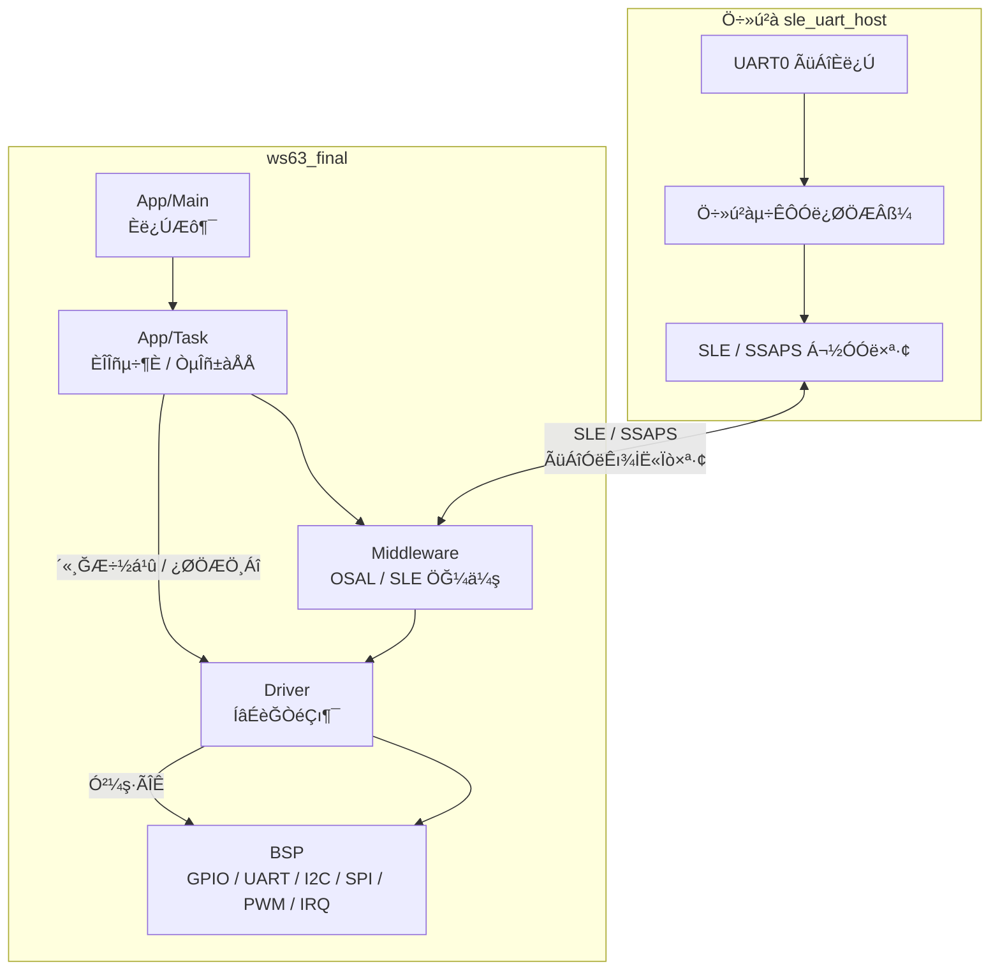

# WS63 Final Layered Framework

## 1. ¼Ü¹¹¶¨Î»

±¾ÏµÍ³ÃæÏòÃÅËøÖն˵Ķഫ¸ĞÆ÷ЭͬÓë¶àÁ´Â·Í¨ĞÅĞèÇ󣬽áºÏ `ws63_final` µÄÓ¦Ó÷ֲãÓë `sle_uart_host` µÄÖ÷»úÇŽӷ½Ê½£¬²ÉÓÃ×Ôµ×ÏòÉϵķֲãʽÈí¼ş¼Ü¹¹½øĞĞÉè¼Æ¡£ÕûÌå½á¹¹ÓÉ `BSP`¡¢`Driver`¡¢`Middleware`¡¢`App/Task` Óë `App/Main` Îå¸ö²ã¼¶×é³É£¬²¢Í¨¹ıÖ÷»ú²à `sle_uart_host` Íê³É UART0 Óë SLE/SSAPS Ö®¼äµÄÃüÁî½ÓÈë¡¢Êı¾İת·¢ºÍ¿ÉÊÓ»¯µ÷ÊÔ¡£¸Ã¼Ü¹¹µÄ»ù±¾Ô­ÔòÊǵ¥ÏòÒÀÀµ£ºÉϲã½öÄܵ÷ÓÃϲãÌṩµÄ½Ó¿Ú£¬Ï²㲻µÃ·´ÏòÒÀÀµÉϲãÒµÎñÂß¼­¡£ÕâÑù¿ÉÒÔ°ÑÓ²¼ş¼Ä´æÆ÷·ÃÎÊ¡¢Ğ­Òéϸ½Ú´¦ÀíºÍÒµÎñ±àÅÅÑϸñ·ÖÀ룬±ÜÃâÒµÎñ´úÂëÖ±½ÓñîºÏµ×²ãʵÏÖ¡£

´ÓÂÛÎıí´ï½Ç¶È¿´£¬ÕâÒ»¼Ü¹¹µÄºËĞļÛÖµÔÚÓÚ½«¡°ÈÎÎñµ÷¶È¡¢Ğ­Òéת»»¡¢Ó²¼ş·ÃÎÊ¡¢ÒµÎñ±àÅÅ¡±ËÄÀàÖ°Ôğ²ğ·Öµ½²»Í¬Ä£¿éÖĞ£¬Ê¹Ã¿Ò»²ã¶¼Ö»¹Ø×¢×Ô¼ºËùÔڱ߽çÄÚµÄÎÊÌâ¡£¶ÔÓÚʵʱĞÔÒªÇó½Ï¸ß¡¢ÍâÉèÀàĞͽ϶àµÄǶÈëʽÃÅËøϵͳ£¬ÕâÖÖ·½Ê½¿ÉÒÔÏÔÖø½µµÍÄ£¿éñîºÏ¶È£¬ÌáÉı¿Éά»¤ĞÔ¡¢¿ÉÒÆÖ²ĞԺͺóĞøÀ©Õ¹ÄÜÁ¦£¬Í¬Ê±Ò²±ãÓÚÔÚĞÂÔö´«¸ĞÆ÷»òĞÂÔöͨĞÅÁ´Â·Ê±±£³Ö½Ó¿ÚÎȶ¨¡£

### 1.1 Éè¼ÆÄ¿±ê

1. ÃæÏò¶à´«¸ĞÆ÷Эͬ³¡¾°£¬Í³Ò»´¦Àí camera¡¢LD2402¡¢ZW101¡¢TTP229¡¢RGB¡¢·äÃùÆ÷¡¢µç»úÓë±àÂëÆ÷µÈÍâÉèÊı¾İ¡£
2. ÃæÏò¶àÁ´Â·Í¨Ğų¡¾°£¬½«±¾µØ UART ¿ØÖÆ¡¢WK2114 ×Ó´®¿ÚÀ©Õ¹Óë SLE/SSAPS ÎŞÏßÇŽÓͳһÄÉÈëͬһÌ×µ÷¶È¿ò¼Ü¡£
3. ÃæÏòÃÅËøºËĞÄÒµÎñ£¬½«×´Ì¬¹ÜÀí¡¢ÈÏÖ¤Åж¨¡¢¿ªËø¿ØÖÆÓë¸æ¾¯´¦ÀíÊÕÁ²µ½¶ÀÁ¢µÄÒµÎñ±àÅŲ㣬±ÜÃâÒµÎñÂß¼­É¢ÂäÔÚÇı¶¯Ï¸½ÚÖĞ¡£
4. ÃæÏò¹¤³Ì¿Éά»¤ĞÔ£¬È·±£ÈκÎĞÂÔö¹¦Äܶ¼ÄÜÃ÷È·Âäλµ½¶ÔÓ¦²ã¼¶£¬¶ø²»ÊÇ¿ç²ãĞŞ¸Ä¶à¸öÄ£¿é¡£

### 1.2 ·Ö²ãÖ°Ôğ

1. `App/Main`£ºÏµÍ³Ö÷Èë¿Ú£¬Ö»¸ºÔğ´´½¨ÒµÎñ×ÜÈÎÎñ£¬²»³ĞÔؾßÌåÒµÎñÂß¼­¡£
2. `App/Task`£ºÓ¦ÓÃÈÎÎñ²ã£¬¸ºÔğÈÎÎñ³õʼ»¯¡¢ÂÖѯµ÷¶È¡¢ÏûÏ¢¶ÓÁĞ·Ö·¢¡¢ÈÏ֤״̬»ú¡¢´«¸ĞÆ÷½á¹ûÈÚºÏÒÔ¼°ÃÅËøÒµÎñ±àÅÅ¡£
3. `Middleware`£ºÖĞ¼ä¼ş²ã£¬¸ºÔğ OSAL ·â×°¡¢SLE Á¬½ÓÓë SSAPS ת·¢µÈƽ̨ÄÜÁ¦£¬°ÑĞ­ÒéÁ´Â·ºÍϵͳ³éÏó·âװΪÎȶ¨½Ó¿Ú¡£
4. `Driver`£ºÉ豸Çı¶¯²ã£¬¸ºÔğ WK2114¡¢¶à·×Ó´®¿Ú¡¢LD2402¡¢ZW101¡¢camera µÈÍâÉèĞ­ÒéʵÏÖ£¬ÏòÉÏÖ»Êä³ö±ê×¼»¯Êı¾İºÍ¿ØÖƽá¹û¡£
5. `BSP`£º°å¼¶Ö§³Å²ã£¬¸ºÔğ GPIO¡¢UART¡¢I2C¡¢SPI¡¢PWM¡¢IRQ µÈµ×²ã×ÊÔ´·ÃÎÊ£¬ÊÇΨһÔÊĞíÖ±½Ó½Ó´¥ WS63 Ó²¼ş³éÏó½Ó¿ÚµÄ²ã¼¶¡£

Ö÷»ú²à `sle_uart_host` λÓÚϵͳÍⲿ£¬³Ğµ£¡°ÉÏλ»úÃüÁîÈë¿Ú + SLE/SSAPS ÇŽÓÆ÷¡±µÄ½ÇÉ«¡£Ëüͨ¹ı UART0 ½ÓÊÕµ÷ÊÔÖ¸ÁÔÙ½«ÃüÁîת·¢µ½ SLE ÏÂĞĞÁ´Â·£»Í¬Ê±½ÓÊÕ ws63_final µÄ SLE ÉÏĞĞÊı¾İ£¬²¢°Ñ½á¹û»ØÏÔµ½Ö÷»ú´®¿Ú¡£ÕâÑù¿ÉÒ԰ѱ¾µØ¿ØÖÆ̨ºÍÎŞÏßÁ´Â·Í³Ò»ÎªÍ¬Ò»Ìõµ÷ÊÔ±Õ»·¡£

### 1.3 Æô¶¯Á´Â·

ϵͳÆô¶¯ºó£¬`App/Main` ÏÈ´´½¨ `App/Task` ÈÎÎñÈë¿Ú£¬ÔÙÓÉÈÎÎñ²ã°´³õʼ»¯Ë³ĞòÍê³É `Middleware`¡¢`Driver` Óë `BSP` µÄÄÜÁ¦×°Åä¡£Ëæºó£¬¸÷ÒµÎñ×ÓÄ£¿é½øÈë¶ÀÁ¢ÈÎÎñ»ò״̬»úÔËĞн׶Σ¬ÀıÈçµç»úÓë±àÂëÆ÷ÓÃÓÚÔ˶¯¿ØÖÆ£¬LD2402 ÓÃÓÚ¾àÀë¼ì²â£¬ZW101 ÓÃÓÚÖ¸ÎÆÈÏÖ¤£¬TTP229 ÓÃÓÚÃÜÂëÊäÈ룬camera ÓÃÓÚÊÓ¾õʶ±ğ£¬RGB Óë·äÃùÆ÷ÓÃÓÚ״̬·´À¡¡£Ö÷ÈÎÎñ¸ºÔğ°ÑÕâĞ©Ä£¿éµÄ½á¹û»ã×ܳÉÃÅËø״̬£¬²¢ÔÚ±ØҪʱ´¥·¢¿ªËø¡¢±£³Ö¡¢¸æ¾¯»ò»Ö¸´¶¯×÷¡£

### 1.4 Êı¾İÁ÷×éÖ¯

ϵͳÔËĞĞʱ£¬Êı¾İÁ´Â·Í¨³£×ñÑ­¡°²É¼¯ - ·Ö·¢ - ´¦Àí - »Ø´«¡±µÄ˳Ğò×éÖ¯£º

1. ÍâÉèÔÚ `Driver` »ò `BSP` ²ãÍê³É²ÉÑùÓëĞ­ÒéÊÕ°ü¡£
2. ²É¼¯½á¹û½øÈë `App/Task` ²ãµÄ·Ö·¢¶ÓÁĞ»ò»Øµ÷Èë¿Ú¡£
3. ÒµÎñÈÎÎñ¸ù¾İ´«¸ĞÆ÷½á¹ûÍê³ÉÈÏÖ¤Åжϡ¢×´Ì¬¸üкͶ¯×÷¾ö²ß¡£
4. ¾ö²ß½á¹ûÔÙͨ¹ı `Middleware` »òÖ÷»ú²à `sle_uart_host` »Ø´«µ½ÉÏλ»ú£¬Ğγɱջ·¹Û²âÁ´Â·¡£

ÕâÖÖ×éÖ¯·½Ê½µÄ¹Ø¼üÔÚÓÚ½âñî¡£ÈÎÎñÖ®¼äͨ¹ı¶ÓÁĞ¡¢»Øµ÷ºÍ״̬±êÖ¾½øĞн»»¥£¬±ÜÃâͬ²½×èÈûºÍ¿ç²ãÖ±½Óµ÷Óã»Ö÷»úÓëÉ豸֮¼äͨ¹ı SLE/SSAPS ºÍ UART ÇŽӽøĞĞͨĞÅ£¬±ÜÃâÒµÎñÂß¼­Ö±½ÓÒÀÀµ¾ßÌå´®¿ÚʵÏÖ¡£

### 1.5 ¼Ü¹¹ÊÕÒæ

1. ¿Éά»¤ĞÔ¸üÇ¿£ºÃ¿¸öÄ£¿éÖ°Ôğµ¥Ò»£¬ÎÊÌⶨλʱֻĞè¹Ø×¢¶ÔÓ¦²ã¼¶¡£
2. ¿ÉÒÆÖ²ĞÔ¸üºÃ£ºµ×²ãÓ²¼ş²îÒìÖ÷Òª¼¯ÖĞÔÚ `BSP` Óë `Driver`£¬ÒµÎñ²ãÎŞĞè¸ĞÖª¾ßÌå¼Ä´æÆ÷ºÍÒı½Å±ä»¯¡£
3. ¿ÉÀ©Õ¹ĞÔ¸ü¸ß£ºĞÂÔöÍâÉèʱ£¬Ö»ĞèÔÚ `Driver` »ò `App/Task` Ôö¼Ó¶ÔӦģ¿é£¬²¢Í¨¹ıͳһ½Ó¿Ú½ÓÈëÖ÷µ÷¶È¡£
4. ʵʱĞÔ¸üÎȶ¨£ºÈÎÎñµ÷¶È¡¢Ğ­ÒéÊÕ·¢ºÍÓ²¼ş·ÃÎÊ·Ö²ãºó£¬¹Ø¼ü·¾¶¸üÇåÎú£¬±ãÓÚ¿ØÖÆ×èÈûµãºÍ²¢·¢³åÍ»¡£
5. ¹¤³Ì±ß½ç¸üÃ÷È·£ºÃÅËøÒµÎñÂß¼­¡¢Ğ­Òé½âÎöÓëÓ²¼ş¿ØÖƱ˴˸ôÀ룬½µµÍºóĞøÖع¹µÄ³É±¾¡£

## 2. ϵͳ¼Ü¹¹Í¼



## 3. Ŀ¼½á¹¹

```text
ws63_final/
©À©¤©¤ Config/      # ²ÎÊıÅäÖò㣨²¨ÌØÂÊ¡¢Òı½Å¡¢ÈÎÎñ²ÎÊı£©
©À©¤©¤ Common/      # ¹«¹²Ëã·¨/ͨÓù¤¾ß£¨ÎŞÓ²¼şÒÀÀµ£©
©À©¤©¤ BSP/         # WS63 Ó²¼ş³éÏó²ã£¨GPIO/UART/IRQ£©
©À©¤©¤ Driver/      # WK2114 É豸Çı¶¯²ã£¨¼Ä´æÆ÷/FIFO/×Ó´®¿Ú·â×°£©
©À©¤©¤ Middleware/  # OSAL ³éÏó£¨ÈÎÎñ¡¢ÑÓʱ¡¢tick£©
©À©¤©¤ App/Task/    # Ó¦ÓÃÈÎÎñ²ã£¨ÂÖѯµ÷¶È¡¢»Øµ÷·Ö·¢£©
©¸©¤©¤ App/Main/    # Ó¦ÓÃÖ÷Èë¿Ú£¨ÈÎÎñÆô¶¯£©
```

## 4. ¶ÔÍâ½Ó¿Ú

1. `ws63_start()`£ºÆô¶¯×îÖÕ°æÒµÎñÈÎÎñ¡£
2. `ws63_task_register_rx_callback(sub_port, cb)`£º×¢²á×Ó´®¿Ú½ÓÊջص÷¡£
3. `ws63_task_send(sub_port, data, len)`£ºÍ¨¹ıÖ¸¶¨×Ó´®¿Ú·¢ËÍÊı¾İ¡£
4. `ws63_task_buzzer_on(freq_hz)` / `ws63_task_buzzer_off()`£º¿ØÖÆ·äÃùÆ÷¿ª¹ØÓëƵÂÊ¡£
5. `ws63_task_buzzer_set_volume(volume_percent)`£ºÉèÖ÷äÃùÆ÷ÒôÁ¿£¨Õ¼¿Õ±ÈÓ³É䣩¡£
6. `ws63_task_ld2402_reinit()` / `ws63_task_zw101_reinit()`£º´¥·¢Ä£¿éµ÷ÊÔÎÕÊÖÖسõʼ»¯¡£
7. `ws63_task_zw101_echo()/verify()/enroll()/list()/delete()/clear()/cancel()`£ºZW101 Öع¹ºóµÄ×îĞ¡ÒµÎñ½Ó¿Ú¼¯ºÏ¡£
8. `ws63_zw101_task_start()` / `ws63_task_zw101_request_verify()`£ºÃÅËø½Ó½ü´°¿ÚÄÚ´¥·¢ VERIFY ²¢µÈ´ıÈÏÖ¤½á¹û¡£

## 5. ºóĞøÄ£¿éÕûºÏ½¨Òé

1. ÿ¸öÒµÎñÄ£¿é£¨Èç LD2402/ZW101£©ÔÚ `App/Task` ²ã×¢²á×Ô¼ºµÄ `rx_callback`¡£
2. ÒµÎñÄ£¿é½ûÖ¹Ö±½Ó·ÃÎÊ BSP/¼Ä´æÆ÷£¬Ö»Äܵ÷Óà Task/Driver ±©Â¶µÄ±ê×¼½Ó¿Ú¡£
3. Èç¹ûĞÂÔöÓ²¼ş²îÒ죨Òı½Å¡¢²¨ÌØÂÊ¡¢FIFO ãĞÖµ£©£¬ÓÅÏÈ¸Ä `Config`£¬²»¸ÄÒµÎñÂß¼­¡£

## 6. ±àÒ뿪¹Ø

ÔÚ menuconfig ÖĞ¿ªÆô£º

- `Application -> Mine -> Support Mine WS63 final layered framework (WS63 master).`

## 7. ±¸×¢

µ±Ç°¿ò¼ÜÒÑÍê³É»ù´¡Á´Â·£º

1. WS63 Ö÷¿Ú³õʼ»¯¡£
2. WK2114 Ö÷¿Ú×Ô¶¯²¨ÌØÆ¥Åä¡£
3. ×Ó´®¿Ú°´ÅäÖóõʼ»¯¡£
4. ÂÖѯ¶ÁÈ¡²¢»Øµ÷·Ö·¢¡£

ÄãºóĞøÖ»ĞèÒªÔÚ `App/Task` ²ãÀ©Õ¹ÒµÎñÂß¼­£¬¼´¿ÉÍê³É¶àÄ£¿éͳһÕûºÏ¡£

## 8. µ÷ÊÔÃüÁîÎĵµ

- ´®¿ÚÔÚÏ߿زâÃüÁîÓëÈÕ־˵Ã÷Çë²é¿´£º`DEBUG_COMMANDS.md`

## 9. ÈÎÎñά»¤¼Ç¼

### 2026-04-14: README ¼Ü¹¹ËµÃ÷°´ ws63_final Óë sle_uart_host ¿Ú¾¶Í³Ò»

±ä¸üÕªÒª£º
- ½«¼Ü¹¹¶¨Î»¸ÄдΪÃæÏòÃÅËøÖն˶ഫ¸ĞÆ÷Óë¶àÁ´Â·Í¨Ğŵķֲãʽ˵Ã÷£¬Ã÷È· ws63_final Óë sle_uart_host µÄÖ°Ôğ±ß½ç¡£
- ²¹³äϵͳ¼Ü¹¹ Mermaid ͼ£¬Õ¹Ê¾Ö÷»ú²à UART0 -> SLE/SSAPS -> ws63_final µÄÍêÕûÊı¾İÁ´Â·¡£
- ±£ÁôÔ­ÓĞĿ¼½á¹¹ÓëºóĞøÄ£¿éÕûºÏ½¨Ò飬²¢°Ñ²ã¼¶ÃèÊöÊÕÁ²µ½ App/Main¡¢App/Task¡¢Middleware¡¢Driver¡¢BSP µÄµ¥ÏòÒÀÀµ¹Øϵ¡£

Ó°ÏìÎļş£º
- `src/application/mine/ws63_final/README.md`

ÑéÖ¤½á¹û£º
- Îĵµ¸üĞ£¬ÎŞĞè±àÒë¡£

·çÏÕ/ºóĞø£º
- ÈôºóĞø ws63_final ĞÂÔö¶ÀÁ¢·şÎñ²ã»òеÄÖ÷»úÇŽÓÁ´Â·£¬ÔÙͬ²½µ÷Õû Mermaid ͼÖеÄÄ£¿é±ß½ç¡£

### 2026-04-14: README ¼Ü¹¹¶ÎÀ©Õ¹ÎªÂÛÎÄÕıÎÄ

±ä¸üÕªÒª£º
- ½«¼Ü¹¹¶¨Î»À©Õ¹ÎªÊʺÏÂÛÎÄÖ±½ÓÒıÓõÄÕıÎıí´ï£¬²¹³äÉè¼ÆÄ¿±ê¡¢·Ö²ãÖ°Ôğ¡¢Æô¶¯Á´Â·¡¢Êı¾İÁ÷×éÖ¯ºÍ¼Ü¹¹ÊÕÒæ¡£
- ±£ÁôÔ­ÓĞ Mermaid ͼºÍĿ¼½á¹¹£¬È·±£ÂÛÎÄÕıÎÄÓ빤³Ì˵Ã÷±£³ÖÒ»Ö¡£
- Ç¿»¯Ö÷»ú²à `sle_uart_host` Óë ws63_final Ö®¼äµÄÇŽӹØϵÃèÊö£¬±ãÓÚ´Óϵͳ¼¶ËµÃ÷ÕûÌåÈí¼ş±Õ»·¡£

Ó°ÏìÎļş£º
- `src/application/mine/ws63_final/README.md`

ÑéÖ¤½á¹û£º
- Îĵµ¸üĞ£¬ÎŞĞè±àÒë¡£

·çÏÕ/ºóĞø£º
- ÈôÂÛÎĺóĞø»¹ĞèÒª¡°Ê±Ğòͼ¡±»ò¡°Ä£¿éĞ­×÷ͼ¡±£¬¿É¼ÌĞøÔÚ±¾Îļş²¹³ä¶ÔÓ¦ Mermaid ͼ¡£

### 2026-04-14: ¹ÜÀíÈÎÎñÕ»ÌáÉıµ½ 8KB

±ä¸üÕªÒª£º
- ½« `WS63_MGR_TASK_STACK_SIZE` ÌáÉıµ½ `8192U`£¬±ÜÃâµ÷ÊÔÃüÁ״̬»úºÍÈÕÖ¾ÔÚͬһ¹ÜÀíÈÎÎñÄÚµş¼Óʱ·¢ÉúÕ»Òç³ö¡£
- ±£Áô `WS63_TASK_STACK_SIZE` ×÷Ϊ·Ç¹ÜÀí³¡¾°Ä¬ÈÏÖµ£¬²»Ó°ÏìÆäËüÈÎÎñµÄÕ»ÅäÖá£
- ͬ²½¸üĞÂÅäÖÃ×¢ÊÍ£¬Ã÷È· 8KB Ô¤Áô¸øÃüÁî½âÎöºÍÈÕÖ¾·åÖµ¡£

Ó°ÏìÎļş£º
- `src/application/mine/ws63_final/Config/ws63_final_config.h`
- `src/application/mine/ws63_final/README.md`

ÑéÖ¤½á¹û£º
- ÃüÁ`cd /home/xixi/code/fbb_ws63_20260114/src && python3 build.py -c ws63-liteos-app`
- ½á¹û£ºÍ¨¹ı£¬ÈÕÖ¾°üº¬ `Build target:ws63_liteos_app success` ºÍ `packet success!`¡£

·çÏÕ/ºóĞø£º
- ÈôºóĞø¹ÜÀíÈÎÎñ¼ÌĞøµş¼Ó¸ü¶àµ÷ÊÔÈë¿Ú£¬ÔÙ½áºÏջˮλͳ¼ÆÆÀ¹ÀÊÇ·ñĞèÒª½øÒ»²½Ôö´ó¡£

### 2026-04-14: LD2402 LOG ON/OFF »Ö¸´Ö÷»úÉÏĞĞ¿ØÖÆ

±ä¸üÕªÒª£º
- ½« `LD2402` Ö÷»ú²àÉÏĞĞÖØĞ°󶨵½ÈÕÖ¾¿ª¹Ø£¬`LD LOG OFF` ¸ºÔğ¾²Òô£¬`LD LOG ON` ¸ºÔğ»Ö¸´¾àÀëĞĞ¡£
- ±£³Ö `ZW101` µÄ Hex Ô¤ÀÀ²ßÂÔ²»±ä£¬±ÜÃâԭʼ¶ş½øÖƼÌĞøË¢µ½Ö÷»úÖնˡ£
- ÕâÑù `LD LOG ON` / `OFF` µÄÏÖ³¡·´À¡ÓëÃüÁîÓïÒåÖØĞÂÒ»Ö£¬±ãÓÚÅÅÕÏʱÁÙʱ¿ª¹Ø¡£

Ó°ÏìÎļş£º
- `src/application/mine/ws63_final/App/Task/ws63_final_task.c`
- `src/application/mine/ws63_final/README.md`

ÑéÖ¤½á¹û£º
- ´ıÖØй¹½¨ÑéÖ¤¡£

·çÏÕ/ºóĞø£º
- `LD LOG ON` ÏÖÔÚ»á»Ö¸´Ö÷»ú²à¾àÀëĞĞ£¬ÈôĞèÒªÔٴξ²Òô£¬¼ÌĞøÖ´ĞĞ `LD LOG OFF` ¼´¿É¡£

### 2026-04-14: DEBUG INIT Áª¶¯¹Ø LD ÈÕÖ¾²¢È¡Ïû ZW101

±ä¸üÕªÒª£º
Ó°ÏìÎļş£º
- `src/application/mine/ws63_final/App/Task/ws63_final_task_debug.c`
- `src/application/mine/ws63_final/App/Task/ws63_final_task_sensor_bridge.c`
- `src/application/mine/ws63_final/App/Task/ws63_final_task_lock_mgr.c`
- `src/application/mine/ws63_final/App/Task/ws63_final_task.h`
- `src/application/mine/ws63_final/Driver/ld2402.c`
- `src/application/mine/ws63_final/README.md`

ÑéÖ¤½á¹û£º
- ´ıÖ´Ğй¹½¨ÑéÖ¤¡£

### 2026-04-14: LD2402 Ö÷»ú¾²Òô + ZW101 Hex Ô¤ÀÀ

±ä¸üÕªÒª£º
- ÔÚ `ws63_task_post_sle_uplink()` Àｫ `LD2402` ×Ó¿ÚÉÏĞĞÖ±½Ó¾²Òô£¬²»ÔٰѾàÀëË¢ÆÁ͸´«µ½Ö÷»ú¡£
- ½« `ZW101` ×Ó¿Úԭʼ¶ş½øÖÆÉÏĞĞÊÕÁ²Îª¶Ì Hex Ô¤ÀÀÎı¾£¬±ÜÃâÖ÷»úÖÕ¶ËÖ±½ÓÏÔʾÂÒÂë¡£
- ĞÂÔö±¾µØ Hex Ô¤ÀÀÖúÊÖ£¬±£ÁôÖ¡Í·ºÍÇ°¼¸¸ö×Ö½Ú£¬±ãÓÚÈ·ÈÏÁ´Â·ÈÔÈ»¿É¶Á¡£
- ÈÔ±£Áô `DEBUG INIT` Ö®ºóµÄµ÷ÊÔÃüÁî»ØÖ´Óë±ØҪ״̬ÈÕÖ¾£¬²»Ó°ÏìÃüÁî½»»¥¡£

Ó°ÏìÎļş£º
- `src/application/mine/ws63_final/App/Task/ws63_final_task.c`
- `src/application/mine/ws63_final/README.md`

ÑéÖ¤½á¹û£º
- ¹¹½¨ÃüÁ`cd /home/xixi/code/fbb_ws63_20260114/src && python3 build.py -c ws63-liteos-app`
- ¹¹½¨½á¹û£ºÍ¨¹ı£¬´ò°üÁ÷³ÌÒÑÍê³É£¬ÈÕ־β²¿°üº¬ `packet app` Óë `copy_files_to_interim done!`¡£

·çÏÕ/ºóĞø£º
- `ZW101` Ŀǰֻչʾ Hex Ô¤ÀÀ£¬²»ÔÙ͸´«ÍêÕûԭʼ֡£»ÈôºóĞøĞèҪץÍêÕû°ü£¬ĞèÒªµ¥¶ÀÔö¼ÓÊܿص÷ÊÔÈë¿Ú¡£

### 2026-04-14: DEBUG INIT ´¿µ÷ÊԻỰÃÅ¿Ø

±ä¸üÕªÒª£º
- ĞÂÔö `DEBUG INIT` / `DEBUG EXIT` / `DEBUG STAT` Èı¸ö»á»°ÃüÁÓÃÓÚÔÚÔËĞĞʱÇĞ»»´¿µ÷ÊÔģʽ¡£
- µ÷ÊÔģʽ¿ªÆôºó£¬ÃÅËø±àÅÅÈÎÎñ¸ÄΪÑÓºóÆô¶¯£»ÈôÒÑÆô¶¯£¬Ôò½øÈëĞü¹Ò̬²¢Çå¿ÕÀúÊ·ÈÏ֤ʼş£¬±ÜÃâÍ˳öµ÷ÊÔºóÎó´¥·¢¿ªËø¡£
- `ws63_task_entry` ¸ÄΪÏÈ´¦Àíµ÷ÊÔÃüÁî¡¢ÔÙ°´¹Û²ì´°¿Ú¾ö¶¨ÊÇ·ñÀ­Æğ `lock_mgr`£¬´Ó¶ø¸øÖ÷»úÊäÈë `DEBUG INIT` Áô³öÈë¿Ú¡£
- δ½øÈë `DEBUG INIT` ʱ£¬É豸²à²»ÔÙÏòÖ÷»úÉϱ¨ LD2402 / ZW101 µÈ³£¹æÔËĞĞÈÕÖ¾£¬Ö÷»ú´®¿ÚÖ»±£Áô±ØÒªÁ´Â·Êä³ö¡£
- ͬ²½¸üĞ `DEBUG_COMMANDS.md`£¬²¹³äµ÷ÊԻỰÓïÒåÓëÅÅÕÏ˵Ã÷¡£

Ó°ÏìÎļş£º
- `src/application/mine/ws63_final/App/Task/ws63_final_task.c`
- `src/application/mine/ws63_final/App/Task/ws63_final_task_debug.c`
- `src/application/mine/ws63_final/App/Task/ws63_final_task_debug.h`
- `src/application/mine/ws63_final/App/Task/ws63_final_task_internal.h`
- `src/application/mine/ws63_final/App/Task/ws63_final_task_lock_mgr.c`
- `src/application/mine/ws63_final/Config/ws63_final_config.h`
- `src/application/mine/ws63_final/DEBUG_COMMANDS.md`
- `src/application/mine/ws63_final/README.md`

ÑéÖ¤½á¹û£º
- ¹¹½¨ÃüÁ`cd /home/xixi/code/fbb_ws63_20260114/src && python3 build.py -c ws63-liteos-app`
- ¹¹½¨½á¹û£ºÍ¨¹ı£¬ÈÕÖ¾°üº¬ `Build target:ws63_liteos_app success` Óë `packet success!`¡£

### 2026-04-14: Ñϸñ SLE Ö÷´Óµ÷ÊÔÁ´Â·ÊÕÁ²£¨Host ¿ØÖÆ + Slave »ØÏÔ£©

±ä¸üÕªÒª£º
- ĞÂÔö `ws63_final` Ñϸñģʽ¿ª¹Ø `WS63_DEBUG_STRICT_SLE_ONLY`£¬²¢ÔÚ±àÒëÆÚÇ¿ÖÆÔ¼Êø£º`SLE_CMD=1`¡¢`SLE_LOG=1`¡¢`LOCAL_UART_IO=0`¡£
- Ö÷»ú `sle_uart_host` ĬÈÏÃüÁîÈë¿ÚÊÕÁ²µ½ `UART0`£¬²¢ĞÂÔöÑϸñÈë¿Ú¿ª¹Ø£¬±ÜÃâ·ÇÃüÁî´®¿ÚÔëÉùÎóÏ·¢µ½´Ó»ú¡£
- Ö÷»úÔö¼Ó `[DEBUG]` ±êÇ©·ÖÁ÷´òÓ¡£ºÊÕµ½´Ó»úµ÷ÊÔÉÏĞкóÖ±½ÓÊä³ö `[mine host][DEBUG]` ¿É¶ÁÈÕÖ¾Ô¤ÀÀ¡£
- ͬ²½¸üĞ `DEBUG_COMMANDS.md`£¬²¹ÆëÑϸñģʽ¿ª¹ØÓëÖ÷»ú²àÅäÖÃ/ÅÅÕÏ¿Ú¾¶¡£

Ó°ÏìÎļş£º
- `src/application/mine/sle_uart_host/inc/sle_uart_host.h`
- `src/application/mine/sle_uart_host/src/sle_uart_host.c`
- `src/application/mine/sle_uart_host/src/sle_uart_host_ssaps.c`
- `src/application/mine/ws63_final/Config/ws63_final_config.h`
- `src/application/mine/ws63_final/DEBUG_COMMANDS.md`
- `src/application/mine/ws63_final/README.md`

ÑéÖ¤½á¹û£º
- ¹¹½¨ÃüÁ`cd /home/xixi/code/fbb_ws63_20260114/src && python3 build.py ws63-liteos-app`
- ¹¹½¨½á¹û£ºÍ¨¹ı£¬ÈÕÖ¾°üº¬ `Build target:ws63_liteos_app success` Óë `packet success!`¡£

### 2026-04-13: TTP229 ¸ÄΪ°´Ï»º´æ¡¢Ì§ÆğÌá½»

±ä¸üÕªÒª£º
- ½« TTP229 ÃÜÂëÊäÈë¸Ä³É±ßÑØÓïÒ壺°´ÏÂÖ»¸ºÔğ·äÃùÌáʾ²¢ĞøÃü auth window£¬Ì§ÆğºóÔÙÌá½»Ò»´ÎÊäÈë¡£
- ĞÂÔö pending-mask »º´æ£¬±ÜÃⳤ°´Í¬Ò»°´¼üʱÖظ´ÈëÂë»òÖظ´´¥·¢ `#` Ìá½»¡£
- ±£Áôµ¥¼üÊäÈëÁ÷³Ì£¬ÇÒÔÚ¶à¼ü»òÒ쳣״̬ʱÇå¿Õ pending£¬±ÜÃâÔà״̬ÑØÓõ½ÏÂÒ»´ÎÊäÈë¡£
- ά³ÖÏÖÓĞÃÜÂëĞ£ÑéÓ뱨¾¯Éϱ¨Á´Â·²»±ä£¬Ö»µ÷Õû Task ²ãµÄÊäÈëÏû·Ñʱ»ú¡£

Ó°ÏìÎļş£º
- `src/application/mine/ws63_final/App/Task/ws63_final_task_ttp229.c`
- `src/application/mine/ws63_final/README.md`

ÑéÖ¤½á¹û£º
- ¹¹½¨ÃüÁ`cd /home/xixi/code/fbb_ws63_20260114/src && python3 build.py ws63-liteos-app`
- ¹¹½¨½á¹û£ºÍ¨¹ı£¬ÈÕÖ¾°üº¬ `Build target:ws63_liteos_app success` Óë `packet success!`¡£

### 2026-04-14: TTP229 ĞøÃüÈÕÖ¾¸ÄΪ̧Æğºó³É¹¦Ìá½»

±ä¸üÕªÒª£º
- ½« TTP229 µÄĞøÃüÈÕÖ¾´Ó¡°Ã¿¸ö°´×¡²ÉÑù¡±Ç¨ÒƵ½¡°Ì§ÆğºóÌá½»³É¹¦¡±Â·¾¶£¬¼õÉÙ°´×¡½×¶ÎË¢ÆÁ¡£
- °´¼ü°´Ï½׶ÎÖ»±£Áô·äÃùÌáʾÓë״̬»º´æ£¬auth window ĞøÃüÑӺ󵽳ɹ¦Ìá½»ºóÔÙÖ´ĞĞ¡£
- `#` µÄ×îÖÕĞ£ÑéÈÔ±£Áô̧Æğ´¥·¢ÓïÒ壬³É¹¦Ğ£Ñéºó²¹Ò»´ÎĞøÃü²¢´òÓ¡ÏÔʽÈÕÖ¾¡£

Ó°ÏìÎļş£º
- `src/application/mine/ws63_final/App/Task/ws63_final_task_ttp229.c`
- `src/application/mine/ws63_final/README.md`

ÑéÖ¤½á¹û£º
- ´ıÖ´Ğй¹½¨ÑéÖ¤¡£

### 2026-04-13: TTP229 ĞøÃüÏÔʽÈÕÖ¾²¹Æë

±ä¸üÕªÒª£º
- ÔÚ TTP229 ²ÉÑùÈë¿ÚÔö¼ÓÏÔʽĞøÃüÈÕÖ¾£¬½öÔÚ `armed` ÇÒˢгɹ¦Ê±Êä³ö¡£
- ÈÕÖ¾ÄÚÈİ°üº¬°´¼üÎı¾/λͼ£¬ÒÔ¼°ĞøÃüÇ°ºóµÄ auth window deadline£¬±ãÓÚÏÖ³¡È·ÈÏ¡°ÈÎÒ»°´¼ü°´Ï¶¼»áĞøÃü¡±¡£
- ±£³ÖËø¹ÜÀíÆ÷Ö»¸ºÔğ״̬ÃÅ¿Ø£¬²»°ÑÈÕÖ¾Âß¼­Ï³Áµ½×´Ì¬»úÄÚ²¿¡£

Ó°ÏìÎļş£º
- `src/application/mine/ws63_final/App/Task/ws63_final_task_ttp229.c`
- `src/application/mine/ws63_final/App/Task/ws63_final_task_lock_mgr.c`
- `src/application/mine/ws63_final/App/Task/ws63_final_task_internal.h`
- `src/application/mine/ws63_final/README.md`

ÑéÖ¤½á¹û£º
- ¹¹½¨ÃüÁ`cd /home/xixi/code/fbb_ws63_20260114/src && python3 build.py ws63-liteos-app`
- ¹¹½¨½á¹û£ºÍ¨¹ı£¬ÈÕÖ¾°üº¬ `Build target:ws63_liteos_app success` Óë `packet success!`¡£

### 2026-04-13: VERIFY ʧ°Üºó¸ÄΪ 0.3s ÂÖѯÀëÊÖ£¨½ö ACK=0x02 ²ÅÖØÊÔ£©

±ä¸üÕªÒª£º
- µ÷Õû `ws63_task_zw101_request_verify_after_release()`£ºVERIFY ʧ°Üºóͳһ½øÈë `wait_release`£¬²»ÔÙ¶Ô `NOT_PRESSED` Á¢¼´ÖØÊÔ¡£
- ½«ÀëÊÖÂÖѯ¼ä¸ôµ÷ÕûΪ `300ms`£¬Ã¿´Îµ÷Óà `PS_GetImageInfo(0x3D)` ¼ì²â°´Ñ¹×´Ì¬¡£
- ½öÔÚÈ·ÈÏ `ACK=0x02`£¨ÎŞÊÖÖ¸£©ºó²ÅÅŶÓÏÂÒ»´Î VERIFY£¬±ÜÃâÁ¬Ğø¿Õ¼ìµ¼Ö¸ßƵÖØÈë¡£
- ĞŞÕı ZW101 ½ûÓüÆÊı¹æÔò£º`ACK=0x09 (NOT_PRESSED)` ²»ÔÙ¼ÆÈë `fail_streak`£¬±ÜÃ⡰δ°´Ñ¹¡±°Ñ½ûÓÃãĞÖµ´òÂú¡£

Ó°ÏìÎļş£º
- `src/application/mine/ws63_final/App/Task/ws63_final_task_sensor_bridge.c`
- `src/application/mine/ws63_final/README.md`

ÑéÖ¤½á¹û£º
- menuconfig Ô¤¼ì²éÃüÁ`cd /home/xixi/code/fbb_ws63_20260114 && bash tools/check_ws63_menuconfig.sh`
- Ô¤¼ì²é½á¹û£ºÊ§°Ü£¨½Å±¾È±Ê§£¬`No such file or directory`£©¡£
- ¹¹½¨ÃüÁ`cd /home/xixi/code/fbb_ws63_20260114/src && python3 build.py ws63-liteos-app`
- ¹¹½¨½á¹û£ºÍ¨¹ı£¬ÈÕÖ¾°üº¬ `Build target:ws63_liteos_app success` Óë `packet success!`¡£

### 2026-04-13: ÀëÊÖ¼ì²âÇĞ»»Îª PS_GetImageInfo£¨ACK=0x02 ÎŞÊÖÖ¸£©

±ä¸üÕªÒª£º
- ½« ZW101 ÀëÊÖ¼ì²â½Ó¿Ú `zw101_check_finger_present()` µÄµ×²ãÃüÁî´Ó `CheckSensor(0x36)` ÇĞ»»Îª `PS_GetImageInfo(0x3D)`¡£
- Ã÷È· ACK ÓïÒ壺`0x00=ÓĞÊÖÖ¸`¡¢`0x02=ÎŞÊÖÖ¸`£¬ÓëÏÖ³¡Åж¨¿Ú¾¶±£³ÖÒ»Ö¡£
- ±£³ÖÂÖѯ·¾¶ `trace_silent=1U`£¬±ÜÃâ¸ßƵÀëÊÖ¼ì²âµ¼Ö´®¿ÚÈÕ־ˢÆÁ¡£

Ó°ÏìÎļş£º
- `src/application/mine/ws63_final/Driver/zw101.c`
- `src/application/mine/ws63_final/Driver/zw101.h`
- `src/application/mine/ws63_final/README.md`

ÑéÖ¤½á¹û£º
- menuconfig Ô¤¼ì²éÃüÁ`cd /home/xixi/code/fbb_ws63_20260114 && bash tools/check_ws63_menuconfig.sh`
- Ô¤¼ì²é½á¹û£ºÊ§°Ü£¨½Å±¾È±Ê§£¬`No such file or directory`£©¡£
- ¹¹½¨ÃüÁ`cd /home/xixi/code/fbb_ws63_20260114/src && python3 build.py ws63-liteos-app`
- ¹¹½¨½á¹û£ºÍ¨¹ı£¬ÈÕÖ¾°üº¬ `Build target:ws63_liteos_app success` Óë `packet success!`¡£

### 2026-04-13: ZW101 NOT_PRESSED ʧ°Ü¼ÆÊı¸ôÀ루±ÜÃâ¿ìËÙ lockout/½ûÓã©

±ä¸üÕªÒª£º
- ÔÚ ZW101 task ĞÂÔö `ws63_task_zw101_get_last_verify_ack()`£¬Ïò lock_mgr ±©Â¶×î½üÒ»´Î VERIFY ACK¡£
- µ÷Õû ZW101 Á¬Ğøʧ°Ü½ûÓüÆÊı£º`ACK=0x09 (NOT_PRESSED)` ²»ÔÙ¼ÆÈë `fail_streak`£¬±ÜÃâÎó´¥·¢¡°5 ´Î½ûÓᱡ£
- µ÷Õû lock_mgr ʧ°Ü¼ÆÊı£ºµ±ÈÏÖ¤À´Ô´Îª ZW101 ÇÒ×î½ü ACK Ϊ `0x09` ʱ£¬Ìø¹ı `fail_count` µİÔö£¬²»½øÈë lockout¡£
- ±£ÁôÖØÊÔÁ´Â·£º`0x09` ÈÔ´¥·¢´°¿ÚÄÚÖØÊÔ£¬µ«²»»á°Ñ¡°Î´°´Ñ¹¡±µ±×÷ÕæʵÈÏ֤ʧ°ÜÀÛ¼Ó¡£

Ó°ÏìÎļş£º
- `src/application/mine/ws63_final/App/Task/ws63_final_task_sensor_bridge.c`
- `src/application/mine/ws63_final/App/Task/ws63_final_task_lock_mgr.c`
- `src/application/mine/ws63_final/App/Task/ws63_final_task_internal.h`
- `src/application/mine/ws63_final/README.md`

ÑéÖ¤½á¹û£º
- menuconfig Ô¤¼ì²éÃüÁ`cd /home/xixi/code/fbb_ws63_20260114 && bash tools/check_ws63_menuconfig.sh`
- Ô¤¼ì²é½á¹û£ºÊ§°Ü£¨½Å±¾È±Ê§£¬`No such file or directory`£©¡£
- ¹¹½¨ÃüÁ`cd /home/xixi/code/fbb_ws63_20260114/src && python3 build.py ws63-liteos-app`
- ¹¹½¨½á¹û£ºÍ¨¹ı£¬ÈÕÖ¾°üº¬ `Build target:ws63_liteos_app success` Óë `packet success!`¡£

### 2026-04-13: ZW101 NOT_PRESSED ʧ°ÜÖØÊÔĞŞ¸´£¨±ÜÃâ±¾´°¿Ú¿¨ÔÚ wait_release£©

±ä¸üÕªÒª£º
- ÔÚ ZW101 task ÖĞĞÂÔö¡°×î½üÒ»´Î VERIFY ACK¡±¼Ç¼£¬ÓÃÓÚÖØÊÔ·¾¶¾ö²ß¡£
- µ±×î½üÒ»´Îʧ°Ü ACK Ϊ `NOT_PRESSED(0x09)` ʱ£¬Ê§°ÜºóµÄÖØÊÔ¸ÄΪ¡°Á¢¼´ÖØĞÂÇëÇó VERIFY¡±£¬²»ÔÙ½øÈë `wait_release`¡£
- ±£ÁôÔ­ÓĞÀëÊÖºóÖØÊÔ»úÖÆ£º·Ç `NOT_PRESSED` µÄʧ°ÜÈÔ½øÈë `wait_release`£¬¼ì²âµ½ÀëÊÖºóÔÙÅŶÓÖØÊÔ¡£
- ÖØÖà ARMED ´°¿Ú±£»¤×´Ì¬¡¢ÈÎÎñÆô¶¯Óë reinit ʱͬ²½ÇåÀí×î½ü ACK£¬±ÜÃâ¿ç´°¿ÚÑØÓó¾É״̬¡£

Ó°ÏìÎļş£º
- `src/application/mine/ws63_final/App/Task/ws63_final_task_sensor_bridge.c`
- `src/application/mine/ws63_final/README.md`

ÑéÖ¤½á¹û£º
- menuconfig Ô¤¼ì²éÃüÁ`cd /home/xixi/code/fbb_ws63_20260114 && bash tools/check_ws63_menuconfig.sh`
- Ô¤¼ì²é½á¹û£ºÊ§°Ü£¨½Å±¾È±Ê§£¬`No such file or directory`£©¡£
- ¹¹½¨ÃüÁ`cd /home/xixi/code/fbb_ws63_20260114/src && python3 build.py ws63-liteos-app`
- ¹¹½¨½á¹û£ºÍ¨¹ı£¬ÈÕÖ¾°üº¬ `Build target:ws63_liteos_app success`¡£

### 2026-04-13: ZW101 ÀëÊÖÂÖѯ½µÔ루״̬±ä»¯´òÓ¡ + Çı¶¯¾²Ä¬ÂÖѯ£©

±ä¸üÕªÒª£º
- ÔÚ `wait_release` ½×¶Î°Ñ `CheckSensor` ÂÖѯ¼ä¸ô´Ó 120ms µ÷ÕûΪ 400ms£¬½µµÍÎŞĞ§ÂÖѯƵÂÊ¡£
- ½«ÀëÊÖ¼ì²âÈÕÖ¾¸ÄΪ¡°½ö״̬±ä»¯´òÓ¡¡±£¬±ÜÃâ¹Ì¶¨½ÚÅÄÖظ´Êä³ö `release_check`¡£
- ÔÚ ZW101 Çı¶¯ÖĞΪÃüÁîµÈ´ıÁ´Â·ĞÂÔö `trace_silent` ²ÎÊı£¬½ö¶ÔÀëÊÖÂÖѯµÄ `CheckSensor` ÆôÓÃÏêϸ trace ¾²Ä¬¡£
- ±£Áô¹Ø¼üÒµÎñÈÕÖ¾£¨ÀëÊÖºóÖØÊÔÈë¶Ó¡¢VERIFY ³É°Ü¡¢³¬Ê±¸æ¾¯£©£¬²»¸Ä±äÈÏÖ¤ÓïÒå¡£

Ó°ÏìÎļş£º
- `src/application/mine/ws63_final/App/Task/ws63_final_task_sensor_bridge.c`
- `src/application/mine/ws63_final/Driver/zw101.c`
- `src/application/mine/ws63_final/README.md`

ÑéÖ¤½á¹û£º
- ÃüÁ`cd /home/xixi/code/fbb_ws63_20260114/src && python3 build.py ws63-liteos-app`
- ½á¹û£º¹¹½¨Í¨¹ı£¬ÈÕÖ¾°üº¬ `Build target:ws63_liteos_app success` Óë `packet success!`¡£

### 2026-04-13: ZW101 È«Á¿Ç¨ÒÆÖع¹£¨ÒƳı¾É ZA£¬»½ĞѺó VERIFY µÈ´ı½á¹û£©

±ä¸üÕªÒª£º
- °´ `sle_uart_slave` µÄ ZW101 ÒµÎñÄÜÁ¦Öع¹ `ws63_final`£ºÇı¶¯²ãÖ»±£Áô `ENROLL/VERIFY/ECHO/LIST/DEL/CLEAR/CANCEL`£¬ÒƳı¾É `ZA/RAW` ¼æÈİ·¾¶¡£
- ÃÅËø±àÅŸÄΪ¡°½Ó½ü»½ĞѺóÆô¶¯ VERIFY ²¢µÈ´ıÈÏÖ¤½á¹û¡±£¬Ê§°ÜʱÔÚ ARMED ״̬ÏÂÖØ´¥·¢ VERIFY£»Á¬Ğøʧ°Ü´ïµ½ 5 ´Îºó½ûÓà VERIFY ²¢Éϱ¨±¨¾¯ÏûÏ¢¡£
- µ÷ÊÔÃüÁîǰ׺ͳһΪ `ZW`£¬ĞÂÃüÁºÏ£º`ZW INIT/STAT/ECHO/VERIFY/ENROLL/LIST/DEL/CLEAR/CANCEL`¡£
- VERIFY ĬÈϲÎÊıÓë slave ¶ÔÆ룺`level=3, id=0xFFFF, param=0x0000`£¬ÈÕÖ¾Êä³öͳһΪ `VERIFYING / VERIFY SUCCESS / VERIFY FAIL` ·ç¸ñ¡£

Ó°ÏìÎļş£º
- `src/application/mine/ws63_final/Driver/zw101.c`
- `src/application/mine/ws63_final/Driver/zw101.h`
- `src/application/mine/ws63_final/App/Task/ws63_final_task_sensor_bridge.c`
- `src/application/mine/ws63_final/App/Task/ws63_final_task_lock_mgr.c`
- `src/application/mine/ws63_final/App/Task/ws63_final_task_debug.c`
- `src/application/mine/ws63_final/App/Task/ws63_final_task.h`
- `src/application/mine/ws63_final/App/Task/ws63_final_task_internal.h`
- `src/application/mine/ws63_final/DEBUG_COMMANDS.md`
- `src/application/mine/ws63_final/README.md`

ÑéÖ¤½á¹û£º
- ´úÂ뾲̬¼ì²é£ºÍ¨¹ı£¨¸Ä¶¯ÎļşÎŞ IDE ±àÒë´íÎ󣩡£
- ¹¹½¨ÑéÖ¤£º¼û±¾´ÎÈÎÎñÊÕβ±àÒë½á¹û¼Ç¼¡£

### 2026-04-13: camera ·Ö°üÖØ×éĞŞ¸´£¨¼æÈİ [name,score] °ë°ü£©

±ä¸üÕªÒª£º
- ĞŞ¸´ camera ×Ó¿ÚÊÕ°ü±» WK2114 ·ÖƬʱµÄÎóÅĞÎÊÌ⣺ĞÂÔö½ÓÊÕÖØ×黺³å£¬Ö§³Ö°Ñ `"[Noah_Xiang,0.77"` + `"]"` ÕâÀà°ë°üÆ´³ÉÍêÕûÖ¡ºóÔÙÅж¨¡£
- »Ø°ü²ú³ö¹æÔòÔö¼Ó `]` ½áÊø·ûʶ±ğ£¬²¢¼ÌĞø¼æÈİ `\r\n` ½áÊø·û£¬±ÜÃâĞ­Òé½áÊø·û²»Í³Ò»µ¼Ö©ÅĞ¡£
- `score` ½âÎöÔöÇ¿£º³ı `score=0.77 / score:0.77` Í⣬ĞÂÔö¼æÈİ `"[name,0.77]"` ½á¹¹£»ÈÔ°´ `score>=0.75` Åж¨Í¨¹ı¡£
- ±£³ÖÔ­Óйؼü×ÖÅж¨£¨pass/success/ok/allow/fail/deny/error/timeout£©×÷Ϊ¶µµ×£¬²»¸Ä±äÉϲãÃÅËø״̬»ú½Ó¿Ú¡£

Ó°ÏìÎļş£º
- `src/application/mine/ws63_final/App/Task/ws63_final_task_camera.c`
- `src/application/mine/ws63_final/README.md`

ÑéÖ¤½á¹û£º
- ÃüÁ`cd /home/xixi/code/fbb_ws63_20260114/src && python3 build.py ws63-liteos-app`
- ½á¹û£º¹¹½¨Í¨¹ı£¬ÈÕÖ¾°üº¬ `Build target:ws63_liteos_app success` Óë `packet success!`¡£

### 2026-04-13: ÃÅËøÈıÏîÔËĞĞÌ¬ĞŞ¸´Óë¹¹½¨Íê³É

±ä¸üÕªÒª£º
- ÏŞÖÆ»½ĞѺóµÄ LD2402 ¾àÀëÈÕ־ˢÆÁ£¬±ÜÃâÔÚÃÅËøÓĞЧ´°¿ÚÄÚ³ÖĞøÊä³öÎŞ¹Ø `distance` ĞÅÏ¢¡£
- Îȶ¨ TTP229 ÃÜÂëÊäÈëÉúÃüÖÜÆÚ£¬±ÜÃâ `123456` ÔÚ״̬¶¶¶¯Ï±»½Ø¶Ï³Éºó°ë¶ÎÊäÈë¡£
- Ôö¼Ó ZW101 Ö¸ÎÆ×Ô¶¯Ê¶±ğÈÎÎñÓëÇëÇó/È¡ÏûÁ÷³Ì£¬È·±£ÃÅËø½øÈë½Ó½ü´°¿Úºó»áʵ¼ÊÀ­Æğ¼ì²â¡£
- ĞŞÕıмÓÈÎÎñÇŽӴúÂëµÄȱʧÒÀÀµ£¬Íê³É `ws63-liteos-app` ¶Ëµ½¶Ë¹¹½¨¡£

Ó°ÏìÎļş£º
- `src/application/mine/ws63_final/App/Task/ws63_final_task_lock_mgr.c`
- `src/application/mine/ws63_final/App/Task/ws63_final_task_ttp229.c`
- `src/application/mine/ws63_final/App/Task/ws63_final_task_sensor_bridge.c`
- `src/application/mine/ws63_final/App/Task/ws63_final_task.c`
- `src/application/mine/ws63_final/App/Task/ws63_final_task_internal.h`
- `src/application/mine/ws63_final/Driver/zw101.c`
- `src/application/mine/ws63_final/Driver/zw101.h`
- `src/application/mine/ws63_final/README.md`

ÑéÖ¤½á¹û£º
- ÃüÁ`cd /home/xixi/code/fbb_ws63_20260114/src && python3 build.py ws63-liteos-app`
- ½á¹û£ºÍ¨¹ı£¬ÈÕÖ¾×îºóÏÔʾ `Build target:ws63_liteos_app success` Óë `packet success!`¡£

ºóĞøÊÂÏ
- ÉÏ°åºó½¨ÒéÖصã¹Û²ì»½ĞѺó LD2402¡¢TTP229¡¢ZW101 ÈıÌõÁ´Â·µÄÏÖ³¡ÈÕÖ¾£¬È·ÈÏÃÅËø״̬»úÓë¼ì²â´°¿ÚÍêÈ«¶ÔÆë¡£

### 2026-04-12: LD2402 ÃüÁî±ğÃûÊÕÁ²µ½ LD

±ä¸üÕªÒª£º
- ½« `ws63_final` µÄ LD2402 µ÷ÊÔÈë¿ÚÊÕÁ²Îª `LD ...` ǰ׺£¬È¥µô¾É `LD2402 ...` ¼æÈݱğÃû¡£
- µ±Ç°¿ÉÖ´ĞĞÃüÁî½ö±£Áô `LD HELP/INIT/STAT/VERSION/SN/MODE/DIST/DELAY/GET/SET/SAVE/GAIN/AUTO/PROGRESS/ALARM/PWR/SAVE3F/RAW/LOG/LOGINT/LOGSTAT`¡£
- Task ²ãÈÔͨ¹ı LD2402 Çı¶¯ÊµÏÖĞ­Òé´¦Àí£¬µ«¶ÔÍâµ÷ÊÔÃüÁîÃæÖ»±£Áô `LD`£¬±ÜÃâÏÖ³¡½Å±¾¼ÌĞøÒÀÀµ¾É±ğÃû¡£
- ͬ²½¸üĞ `DEBUG_COMMANDS.md`£¬ÒƳı¾Éǰ׺ʾÀıÓë¹ÊÕÏÅŲéÖĞµÄ `LD2402` ÃüÁîĞ´·¨¡£

Ó°ÏìÎļş£º
- `src/application/mine/ws63_final/Driver/ld2402.c`
- `src/application/mine/ws63_final/Driver/ld2402.h`
- `src/application/mine/ws63_final/App/Task/ws63_final_task.h`
- `src/application/mine/ws63_final/App/Task/ws63_final_task_sensor_bridge.c`
- `src/application/mine/ws63_final/App/Task/ws63_final_task_debug.c`
- `src/application/mine/ws63_final/DEBUG_COMMANDS.md`

ÑéÖ¤½á¹û£º
- ÃüÁ`cd /home/xixi/code/fbb_ws63_20260114/src && python3 build.py ws63-liteos-app`
- ½á¹û£ºÍ¨¹ı£¨`Build target:ws63_liteos_app success`£©¡£

ºóĞøÊÂÏ
- ÉÏ°åʱÓÅÏÈÈ·ÈÏ `LD INIT`¡¢`LD VERSION`¡¢`LD SN` Óë `LD STAT` Êä³öÊÇ·ñÕı³£¡£
- ÏÖ³¡½Å±¾ÈçÈÔµ÷ÓþÉǰ׺£¬ĞèÒªÖ±½ÓÇĞ»»µ½ `LD`£¬²»ÔÙÒÀÀµ `LD2402` ¼æÈİÈë¿Ú¡£

### 2026-04-12: RGB Éϵ粻ÔÙĬÈϽøÈë demo£¬LD2402 ÔËĞĞ̬¾àÀëÈÕ־ͳһ½ÚÁ÷

±ä¸üÕªÒª£º
- RGB ÈÎÎñÉϵçºóÖ»×öÓ²¼ş³õʼ»¯£¬²»ÔÙĬÈϽøÈëÑİʾѭ»·£¬±ÜÃâµÆЧÔÚδÏ·¢ÃüÁîʱ×Ô¶¯ÅÜÆğÀ´¡£
- ĞÂÔö `WS63_RGB_DEMO_ENABLE_DEFAULT` ĬÈϲßÂԺ꣬±ãÓÚºóĞø°´ÏÖ³¡ĞèÒªÖØĞ´ò¿ªÑİʾģʽ¡£
- LD2402 µÄ `OFF` / `distance` / ÆÕͨÊı¾İ°üÈÕ־ͳһ×ßͬһÌõ½ÚÁ÷Åжϣ¬±ÜÃâ¾àÀëÎı¾·ÖÖ§ÈƹıÈÕÖ¾¼ä¸ôÏŞÖÆ¡£
- ±£Áô×î½ü¾àÀëÖµÓë¸üĞÂʱ¼äË¢ĞÂÂß¼­£¬½öÊÕ½ô´®¿ÚÊä³öƵÂÊ£¬¼õÉÙÃÅËøÏÖ³¡Ë¢ÆÁ¡£

Ó°ÏìÎļş£º
- `src/application/mine/ws63_final/Config/ws63_final_config.h`
- `src/application/mine/ws63_final/App/Task/ws63_final_task_rgb.c`
- `src/application/mine/ws63_final/Driver/ld2402.c`
- `src/application/mine/ws63_final/README.md`

ÑéÖ¤½á¹û£º
- ÃüÁ`cd /home/xixi/code/fbb_ws63_20260114/src && python3 build.py ws63-liteos-app`
- ½á¹û£ºÍ¨¹ı£¨`Build target:ws63_liteos_app success`£©¡£

### 2026-04-11: TTP229 I2C ÉÏÀ­Èİ´íĞŞ¸´

±ä¸üÕªÒª£º
- ·¢ÏÖ `GPIO15/16` µÄÄÚ²¿ÉÏÀ­ÅäÖÃÔÚµ±Ç°°å¼¶Éϻ᷵»Øʧ°Ü£¬µ«Õâ²»Ó°Ïì TTP229 µÄ I2C ͨĞű¾Éí¡£
- ½« BSP ÖеÄÉÏÀ­ÅäÖøÄΪ¡°¾¡Á¦ÉèÖá¢Ê§°Ü½ö¸æ¾¯¡±£¬±ÜÃâÎó°Ñ¿É»Ö¸´µÄÒı½ÅÄÜÁ¦²îÒìµ±³É³õʼ»¯Ê§°Ü¡£
- ±£³ÖÔ­ÓĞ I2C ¶ÁÁ÷³Ì¡¢Task ״̬»úºÍ±¨¾¯Âß¼­²»±ä£¬Ö»ĞŞÕı³õʼ»¯Èİ´í±ß½ç¡£

Ó°ÏìÎļş£º
- `src/application/mine/ws63_final/BSP/ws63_final_bsp_ttp229.c`
- `src/application/mine/ws63_final/README.md`

ÑéÖ¤½á¹û£º
- ÃüÁ`cd /home/xixi/code/fbb_ws63_20260114/src && python3 build.py ws63-liteos-app`
- ½á¹û£º¹¹½¨Í¨¹ı£¬ÇÒ TTP229 BSP ²»ÔÙÒòÄÚ²¿ÉÏÀ­·µ»ØÂëÖ±½ÓÖĞÖ¹³õʼ»¯¡£

ºóĞøÊÂÏ
- ÉÏ°åʱ¼ÌĞøÓÅÏȹ۲ì TTP229 µÄ `init ok` / `init fail` ÈÕÖ¾£¬ÔÙÈ·ÈÏ°´¼ü¶ÁÊıÊÇ·ñÎȶ¨¡£

### 2026-04-11: TTP229 ¸ÄΪ I2C ¶ÁÈ¡

±ä¸üÕªÒª£º
- ½« `ws63_final` µÄ TTP229 ´Ó¾ÉµÄ SDO/SCL ÖğλɨÃè¸ÄΪ±ê×¼ I2C Ö÷»ú¶ÁÁ÷³Ì¡£
- ±£³Ö GPIO16 / GPIO15 ²»±ä£¬¸ÄΪ¶ÔÓ¦ I2C SDA / SCL Òı½Å¸´ÓÃÓëÉÏÀ­ÅäÖá£
- °´ÊÖ²áͳһΪ 2 ×Ö½ÚÖ±½Ó¶ÁÈ¡£¬°´¼üλÓïÒå±£³ÖΪ `1=°´ÏÂ`¡£
- Task ²ã±£ÁôÔ­ÓĞ״̬»úÓë¶à¼ü±¨¾¯Âß¼­£¬½öͬ²½¸üвÉÑùĬÈÏÖµÓë´íÎóÈÕÖ¾¡£

Ó°ÏìÎļş£º
- `src/application/mine/ws63_final/Config/ws63_final_config.h`
- `src/application/mine/ws63_final/BSP/ws63_final_bsp.h`
- `src/application/mine/ws63_final/BSP/ws63_final_bsp_ttp229.c`
- `src/application/mine/ws63_final/Driver/ws63_ttp229.h`
- `src/application/mine/ws63_final/Driver/ws63_ttp229.c`
- `src/application/mine/ws63_final/App/Task/ws63_final_task_ttp229.c`
- `src/application/mine/ws63_final/DEBUG_COMMANDS.md`

ÑéÖ¤½á¹û£º
- ÃüÁ`cd /home/xixi/code/fbb_ws63_20260114/src && python3 build.py ws63-liteos-app`
- ½á¹û£º¹¹½¨Í¨¹ı£¨`Build target:ws63_liteos_app success`£©¡£

ºóĞøÊÂÏ
- ÉÏ°åºóÓÅÏÈÈ·ÈÏ TTP229 µÄ `INIT/READ/WATCH` ÈÕÖ¾Óëʵ¼Ê´¥Ãş½á¹ûÒ»Ö¡£
- ÈôĞèÒª½øÒ»²½½µµÍ I2C ¶ÁÈ¡¶¶¶¯£¬¿É½áºÏ `INT` Òı½ÅÔÙ²¹Ê¼ş»½ĞѲßÂÔ¡£

### 2026-04-11: TTP229 ³ÖĞø¼ì²âÃüÁî + LD2402 ÃüÁîͳһ

±ä¸üÕªÒª£º
- µ÷ÊÔ´®¿ÚĞÂÔö `TTP229 WATCH ON|OFF` ÃüÁÓÃÓÚÆô¶¯/Í£Ö¹¾ØÕó¼üÅ̳ÖĞø¼ì²âÈÕÖ¾¡£
- ³ÖĞø¼ì²â¸´ÓÃÏÖÓĞ WATCH ÖÜÆÚµ÷¶È£¬Ôڹ̶¨½ÚÅÄÏÂÊä³ö `raw/mask/count`£¬±ãÓڹ۲찴¼üʵʱ±ä»¯¡£
- `ws63_final` ·¶Î§ÄÚ³¹µ×ÒƳı¾ÉÀ×´ïÃüÁîǰ׺£¬Í³Ò»Îª `LD2402 INIT/RAW/STAT/LOG/LOGINT/LOGSTAT`¡£
- ͬ²½ĞŞÕıÎĵµÊÖ²áÓë README µÄÃüÁî¿Ú¾¶£¬±£Ö¤ÏÖ³¡Áªµ÷ÃüÁîÓë°ïÖúÊä³öÒ»Ö¡£

Ó°ÏìÎļş£º
- `src/application/mine/ws63_final/App/Task/ws63_final_task_debug.c`
- `src/application/mine/ws63_final/App/Task/ws63_final_task.h`
- `src/application/mine/ws63_final/App/Task/ws63_final_task_sensor_bridge.c`
- `src/application/mine/ws63_final/DEBUG_COMMANDS.md`
- `src/application/mine/ws63_final/README.md`

ÑéÖ¤½á¹û£º
- ÃüÁ`cd /home/xixi/code/fbb_ws63_20260114/src && python3 build.py ws63-liteos-app`
- ½á¹û£º¹¹½¨Í¨¹ı£¨`Build target:ws63_liteos_app success`£©¡£

ºóĞøÊÂÏ
- Éϰ彨ÒéÏÈÖ´ĞĞ `TTP229 WATCH ON` ÔÙ°´¼ü£¬È·ÈϳÖĞø¼ì²âÈÕÖ¾Õı³££»Íê³ÉºóÖ´ĞĞ `TTP229 WATCH OFF` ¹Ø±Õ³ÖĞøÊä³ö¡£
- ¾ÉÀ×´ïÖ¸Áîǰ׺ÒÑÒƳı£¬ÈçÏÖ³¡½Å±¾ÈÔʹÓþÉǰ׺ĞèͳһÌ滻Ϊ `LD2402 ...`¡£

### 2026-04-11: LD2402 ÉϵçË¢ÆÁÏŞÖÆ£¨ÔËĞĞ̬½ÚÁ÷ + ÔËĞĞʱ¿ª¹Ø£©

±ä¸üÕªÒª£º
- ĞŞ¸´ `ws63_final` ÖĞ LD2402 ÉϵçºóÔËĞĞ̬ÈÕÖ¾³ÖĞøË¢ÆÁÎÊÌ⣺ÔÚ Driver ²ã¶Ô `LD2402 processing ...` Ôö¼Óʱ¼ä½ÚÁ÷£¬Ä¬ÈÏÿ 1000ms ×î¶àÊä³öÒ»´Î¡£
- ±£Áô³õʼ»¯/ʧ°ÜÕï¶ÏÈÕÖ¾£¨Èç `init try`¡¢`init failed`£©£¬È·±£Á´Â·¹ÊÕ϶¨Î»ÄÜÁ¦²»ÊÜÓ°Ïì¡£
- SLE ÖĞ¼ä¼ş½« `uplink send success` ´Ó¡°Ã¿°ü´òÓ¡¡±¸ÄΪ¡°¿É¿ª¹Ø + ¼ä¸ô½ÚÁ÷ + ÒÖÖƼÆÊı¡±£¬Ä¬ÈÏ¹Ø±Õ success Öğ°üÈÕÖ¾£¬Ê§°ÜÈÕÖ¾±£³Ö¼´Ê±Êä³ö¡£
- µ÷ÊÔ´®¿ÚĞÂÔöÔËĞĞʱ¿ØÖÆÃüÁ`LD2402 LOG ON|OFF`¡¢`LD2402 LOGINT <ms>`¡¢`LD2402 LOGSTAT`¡¢`SLE ULOG ON|OFF`¡¢`SLE ULOGINT <ms>`¡¢`SLE ULOGSTAT`£¬ÎŞĞèÖرàÒë¼´¿ÉÏÖ³¡µ÷½ÚÈÕ־ǿ¶È¡£
- ÅäÖòãĞÂÔöĬÈϲßÂԺ꣬ͳһ¿ØÖÆ LD2402 Óë SLE success ÈÕÖ¾³õʼĞĞΪ¡£

Ó°ÏìÎļş£º
- `src/application/mine/ws63_final/Config/ws63_final_config.h`
- `src/application/mine/ws63_final/Driver/ld2402.h`
- `src/application/mine/ws63_final/Driver/ld2402.c`
- `src/application/mine/ws63_final/Middleware/ws63_final_sle.h`
- `src/application/mine/ws63_final/Middleware/ws63_final_sle.c`
- `src/application/mine/ws63_final/App/Task/ws63_final_task.h`
- `src/application/mine/ws63_final/App/Task/ws63_final_task_sensor_bridge.c`
- `src/application/mine/ws63_final/App/Task/ws63_final_task_debug.c`
- `src/application/mine/ws63_final/DEBUG_COMMANDS.md`
- `src/application/mine/ws63_final/README.md`

ÑéÖ¤½á¹û£º
- ÃüÁ`cd /home/xixi/code/fbb_ws63_20260114/src && python3 build.py ws63-liteos-app`
- ½á¹û£º¹¹½¨Í¨¹ı£¨`Build target:ws63_liteos_app success`£©¡£

ºóĞøÊÂÏ
- ÉÏ°å¿ÉÏÈÖ´ĞĞ `LD2402 LOGSTAT` Óë `SLE ULOGSTAT` È·ÈÏĬÈϲßÂÔ£¬ÔÙ°´ÏÖ³¡ĞèÒªÓà `LOGINT` ¶¯Ì¬µ÷Õû½ÚÁ÷´°¿Ú¡£
- ÈôĞèÁÙʱץȫÁ¿°ü¼¶ÈÕÖ¾£¬¿É½«¼ä¸ôÉèΪ `0`£¨ÀıÈç `LD2402 LOGINT 0` / `SLE ULOGINT 0`£©¡£

### 2026-04-10: WK2114 Ö÷¿Ú¶Á·¾¶·À¿¨ËÀĞŞ¸´£¨¹æ±Ü uapi_uart_read ³¤ÂÖѯ£©

±ä¸üÕªÒª£º
- ĞŞ¸´ `ws63_final` Ö÷¿Ú UART ¶Á·¾¶ÔÚµ±Ç°Çı¶¯ÅäÖÃÏ¿ÉÄܳöÏֵij¤ÂÖѯ¿¨ËÀÎÊÌ⣬±ÜÃâ `ws63_wk_task` ³ÖĞø 100% Õ¼Óú󴥷¢ NMI ÖØÆô¡£
- ÔÚ BSP ²ãĞÂÔö¡°°´×Ö½Ú + FIFO ·Ç¿ÕÔ¤ÅĞ + Èí³¬Ê±¡±µÄ°²È«¶ÁÈ¡·â×°£¬Ìæ»»Ö÷¿Ú/µ÷ÊÔ¿ÚÔ­ÓĞÖ±½Ó `uapi_uart_read` µ÷Óá£
- ÖØĞ´Ö÷¿Ú `flush_rx` Ϊ°²È«·Ç×èÈûÖğ×Ö½ÚÇå¿Õ£¬±ÜÃâ `len>1` ¶ÁÈ¡ÔÚÎŞÊı¾İʱÏİÈë²»¿ÉÍ˳öÂÖѯ¡£
- ±£³Ö `Driver/App` Ğ­ÒéÁ÷³Ì²»±ä£¬½öĞŞ¸´µ×²ã¶ÁÈ¡ÓïÒåÓ볬ʱĞĞΪ¡£

Ó°ÏìÎļş£º
- `src/application/mine/ws63_final/BSP/ws63_final_bsp_uart.c`
- `src/application/mine/ws63_final/README.md`

ÑéÖ¤½á¹û£º
- ÃüÁ`cd /home/xixi/code/fbb_ws63_20260114/src && python3 build.py ws63-liteos-app`
- ½á¹û£º¹¹½¨Í¨¹ı£¨`Build target:ws63_liteos_app success`£©¡£

ºóĞøÊÂÏ
- ÉÏ°åÖصã¹Û²ì `ld2402_init` ½×¶ÎÊÇ·ñ²»ÔÙ³öÏÖ `ws63_wk_task` ³¤Ê±¼ä 100% Õ¼ÓÃÓë NMI ÖØÆô¡£
- ÈôÏÖ³¡ÈÔÓĞż·¢³¬Ê±£¬¿ÉÔÙ²¹³ä `ws63_bsp_host_uart_read` µÄ³¬Ê±ÈÕÖ¾£¨¿ªÊ¼/½áÊø/·µ»Ø×Ö½ÚÊı£©ÓÃÓÚ½øÒ»²½¶¨Î»Á´Â·¶¶¶¯¡£

### 2026-04-10: µ÷ÊÔÃüÁîÈÕÖ¾»»ĞиñÊ½ĞŞ¸´£¨\r\n ×ÖÃæÁ¿ÎÊÌ⣩

±ä¸üÕªÒª£º
- ĞŞ¸´ `ws63_final` µ÷ÊÔÃüÁîÈÕÖ¾ÖĞ´íÎóʹÓà `\\r\\n` ×ÖÃæÁ¿µÄÎÊÌ⣬ͳһ¸ÄΪ `\r\n` ¿ØÖÆ·ûÊä³ö¡£
- ĞŞ¸´ºó `uart ready` Óë `command list` µÈÈÕÖ¾°´ĞĞÏÔʾ£¬²»ÔÙ°Ñ `\r\n` ×÷Ϊ¿É¼û×Ö·û´òÓ¡¡£
- ±¾´Î½öµ÷ÕûÈÕÖ¾¸ñʽ£¬²»¸Ä¶¯ÃüÁî½âÎö¡¢Çı¶¯½»»¥ÓëÒµÎñÂß¼­¡£

Ó°ÏìÎļş£º
- `src/application/mine/ws63_final/App/Task/ws63_final_task_debug.c`
- `src/application/mine/ws63_final/README.md`

ÑéÖ¤½á¹û£º
- ÃüÁ`cd /home/xixi/code/fbb_ws63_20260114/src && python3 build.py -c ws63-liteos-app`
- ½á¹û£º¹¹½¨Í¨¹ı£¨`Build target:ws63_liteos_app success`£©¡£

ºóĞøÊÂÏ
- ÉÏ°å¹Û²ì `ws63 dbg` Æô¶¯ÈÕÖ¾Ó¦ÖğĞĞ»»ĞĞÏÔʾ£»
- ÈôÏÖ³¡´®¿Ú¹¤¾ßÈÔÏÔʾתÒåÎı¾£¬Ğè¼ì²éÉÏλ»úÊÇ·ñÆôÓÃÁË¡°ÏÔʾ¿ØÖÆ×Ö·ûתÒ塱ѡÏî¡£

### 2026-04-10: ZW101 ³õʼ»¯³¬Ê±×îĞ¡ĞŞ¸´£¨×Ó¿Ú²¨ÌØÂʶÔÆë 57600£©

±ä¸üÕªÒª£º
- ĞŞ¸´ `ws63_final` ÖĞ ZW101 ×Ó¿ÚĬÈϲ¨ÌØÂÊÓëÄ£×éĬÈÏÖµ²»Ò»ÖµÄÎÊÌ⣺½«×Ó¿Ú1£¨ZW101£©²¨ÌØÂÊ´Ó `115200` ¶ÔÆëµ½ `57600`¡£
- ĞÂÔö ZW101 ³õʼ»¯ÅäÖÃÈÕÖ¾£¬Æô¶¯Ê±´òÓ¡ `ZW101 cfg sub-uartX baud=Y`£¬±ãÓÚÏÖ³¡¿ìËÙÈ·ÈÏÅäÖÃÊÇ·ñÉúЧ¡£
- ±£³ÖÏÖÓĞÎÕÊÖÁ÷³ÌÓë ACK ½âÎö²ßÂÔ²»±ä£¨ÈÔΪ `0x53 -> 0x35 -> check_sensor` ·¾¶£©£¬È·±£±¾ÂָĶ¯·çÏÕ×îĞ¡¡£

Ó°ÏìÎļş£º
- `src/application/mine/ws63_final/Config/ws63_final_config.h`
- `src/application/mine/ws63_final/App/Task/ws63_final_task.c`
- `src/application/mine/ws63_final/README.md`

ÑéÖ¤½á¹û£º
- ÃüÁ`cd /home/xixi/code/fbb_ws63_20260114/src && python3 build.py -c ws63-liteos-app`
- ½á¹û£º¹¹½¨Í¨¹ı£¨`Build target:ws63_liteos_app success`£©¡£

ºóĞøÊÂÏ
- ÉÏ°åºóÖصãºË¶ÔÈÕÖ¾£º`sub-uart1 init ok, baud=57600` Óë `ZW101 cfg sub-uart1 baud=57600`£»
- ÈôÈÔ³öÏÖ `ack=0x26`£¬ÔÙ½øÈëµÚ¶ş½×¶Î£¨Ë«²¨ÌØÂÊ̽²â + ½ÓÊÕͳ¼ÆÈÕÖ¾£©ÅŲéÎïÀí²ã²îÒì¡£

### 2026-04-10: ZW101/LD2402 ³õʼ»¯Ê§°ÜÕï¶ÏÔöÇ¿£¨ÎÕÊÖÃüÁî²ğ·Ö + ʧ°Ü¹Û²â£©

±ä¸üÕªÒª£º
- ½«µ÷ÊÔÃüÁîÖĞµÄ `ZW101 HANDSHAKE` ´Ó `INIT` ±ğÃû¸ÄΪ¡°½ö·¢ËÍ 0x35 ÎÕÊÖ²¢»ØÏÔ ACK¡±£¬±ãÓÚ¿ìËÙÅжϻù´¡Á´Â·ÊÇ·ñ¿É´ï¡£
- ĞÂÔö `ZW101 CHECKSENSOR` ÃüÁ0x36£©£¬ÓÃÓÚÓëÎÕÊÖÃüÁîÅäºÏ¶¨Î»¡°ÎÕÊֳɹ¦µ«´«¸ĞÆ÷¼ì²âʧ°Ü¡±µÄ³¡¾°¡£
- ZW101 Çı¶¯²¹³ä³õʼ»¯·Ö²½ÈÕÖ¾£ºÃ¿ÂÖ´òÓ¡ `echo/handshake/check_sensor` µÄ `ret` Óë `ack`£¬²¢ÔÚÃüÁîµÈ´ı ACK ³¬Ê±Ê±Êä³öÃüÁîÂë¡£
- LD2402 Çı¶¯²¹³ä³õʼ»¯·Ö²½ÈÕÖ¾£ºÃ¿ÂÖ´òÓ¡ `rx_total/valid_frame/enable_ack`£¬ÓÃÓÚÇø·Ö¡°ÍêÈ«ÎŞ»Ø°ü¡±Óë¡°ÊÕµ½Ö¡µ«·ÇÄ¿±ê ACK¡±¡£
- ͬ²½¸üе÷ÊÔÊֲᣬĞÂÔö `ack=0x26`£¨ACK ³¬Ê±£©ÊÍÒåÓëÅŲé˳Ğò¡£

Ó°ÏìÎļş£º
- `src/application/mine/ws63_final/App/Task/ws63_final_task.h`
- `src/application/mine/ws63_final/App/Task/ws63_final_task_sensor_bridge.c`
- `src/application/mine/ws63_final/App/Task/ws63_final_task_debug.c`
- `src/application/mine/ws63_final/Driver/zw101.c`
- `src/application/mine/ws63_final/Driver/ld2402.c`
- `src/application/mine/ws63_final/DEBUG_COMMANDS.md`
- `src/application/mine/ws63_final/README.md`

ÑéÖ¤½á¹û£º
- ÃüÁ`cd /home/xixi/code/fbb_ws63_20260114/src && python3 build.py ws63-liteos-app`
ºóĞøÊÂÏ
- Éϰ彨ÒéÏÈÖ´ĞĞ `ZW101 HANDSHAKE`¡¢`ZW101 CHECKSENSOR`¡¢`ZW101 ZA ECHO`£¬²¢½áºÏĞÂÔö `init try` ÈÕÖ¾ÅжÏÊÇ·ñΪ¡°´®¿ÚÎŞ»Ø°ü¡±¡£
- ¶Ô LD2402 ½¨Òé¹Ø×¢ `init tryN rx_total`£¬ÈôÁ¬ĞøΪ `0`£¬ÓÅÏÈÅŲéÄ£¿é¹©µç¡¢TX/RX ½»²æÓë×Ó¿ÚÁ¬Ïß¡£

### 2026-04-12: ϵͳÉè¼Æ¸å¶ÔÆëÏÖÍøÄÜÁ¦

±ä¸üÕªÒª£º
- ÖØĞ´¸ùĿ¼ [ϵͳÉè¼Æ.md](/home/xixi/code/ϵͳÉè¼Æ.md)£¬½«Îĵµ´Ó¸ÅÄî·½°¸ÊÕÁ²Îª¡°ÏÖÍøÄÜÁ¦ + Ñݽø·Ïß¡±Ë«²ã½á¹¹¡£
- ²¹Æë ws63_final ÒÑʵÏÖµÄÄ£¿é±ß½ç¡¢ÄÜÁ¦¾ØÕó¡¢ÃÅËø״̬»ú¡¢ÈÏÖ¤À´Ô´Óëµ÷ÊÔÃüÁî¿Ú¾¶¡£
- Ã÷È· camera ½ö×÷ΪÍⲿÊÓ¾õÄ£¿éÇŽӣ¬²»Ôٰѱ¾µØÈËÁ³Ë㷨д³É WS63 ÏÖÍøÄÜÁ¦¡£
- ½«±¾µØÃÜÂë¹şÏ£ÈÏÖ¤¡¢¹ØÃżì²âµÈδÂäµØÄÜÁ¦Òƶ¯µ½Ñݽø·Ïߣ¬±ÜÃâÓëÏÖÍøʵÏÖ»ìĞ´¡£

Ó°ÏìÎļş£º
- `/home/xixi/code/ϵͳÉè¼Æ.md`

ÑéÖ¤½á¹û£º
- ¶ÔÕÕ `src/application/mine/ws63_final/README.md`¡¢`src/application/mine/ws63_final/DEBUG_COMMANDS.md` ÒÔ¼°ÏÖÍøÈÎÎñ´úÂëÍê³ÉÈ˹¤ºË¶Ô¡£
- δִĞй¹½¨£»±¾´Î½öĞŞ¸ÄÉè¼ÆÎĵµ£¬Î´Éæ¼°Ô´Âë¡£

ºóĞøÊÂÏ
- ÈçºóĞø ws63_final Ôö¼ÓÃÜÂëÈÏÖ¤»ò¹ØÃżì²â£¬ÔÙ°ÑÑݽø·ÏßÖеĶÔÓ¦ÌõÄ¿ÌáÉıΪÏÖÍøÄÜÁ¦ËµÃ÷¡£

### 2026-04-10: ´®¿Úʵ²âÈÕÖ¾ÎÊÌâĞŞ¸´£¨RGB ĬÈÏ¿ÉÓà + STOP ·ûºÅÏÔʾ£©

±ä¸üÕªÒª£º
- ¸ù¾İÏÖ³¡´®¿ÚÈÕÖ¾¶¨Î» `RGB INIT/SET/DEMO` ·µ»Ø `0xffffffff` µÄ¸ùÒò£º`WS63_RGB_ENABLE` ´¦ÓڹرÕÅäÖá£
- ½« `WS63_RGB_ENABLE` ĬÈÏÖµ´Ó `0` µ÷ÕûΪ `1`£¬Ê¹ `RGB INIT` µÈµ÷ÊÔÃüÁîÔÚĬÈϹ¹½¨Ï¿ÉÖ±½ÓÁªµ÷¡£
- ĞŞÕıµç»ú״̬ÈÕÖ¾µÄ RPM ¹éÒ»»¯Âß¼­£ºÔÚ `STOP/BRAKE` ״̬ϱ£Áô±àÂëÆ÷ԭʼ·ûºÅ£¬±ãÓڹ۲췴תºó¹ßĞÔË¥¼õ·½Ïò¡£
- ±£³Ö·Ö²ã±ß½ç²»±ä£¬½öĞŞ¸ÄÅäÖòãÓë Task µ÷ÊÔÏÔʾÂß¼­¡£

Ó°ÏìÎļş£º
- `src/application/mine/ws63_final/Config/ws63_final_config.h`
- `src/application/mine/ws63_final/App/Task/ws63_final_task_debug.c`
- `src/application/mine/ws63_final/README.md`

ÑéÖ¤½á¹û£º
- ÃüÁ`cd /home/xixi/code/fbb_ws63_20260114/src && python3 build.py ws63-liteos-app`
- ½á¹û£º¹¹½¨Í¨¹ı£¨`Build target:ws63_liteos_app success`£©¡£

ºóĞøÊÂÏ
- Éϰ彨Ò鸴²â£º`RGB INIT` -> `RGB SET 255 0 0` -> `RGB DEMO ON`£»
- ·´×ªºóÖ´ĞĞ `MOTOR STOP`£¬È·È϶ÌÔİÓàתÆÚ¼ä `motor_rpm/out_rps` ·ûºÅÓëʵ¼Ê·½ÏòÒ»Ö¡£

### 2026-04-09: ZW101 ZA ¼æÈİÃüÁîµ÷ÊÔ½ÓÈë + Ö¸Áî×庯Êı²¹Æë

±ä¸üÕªÒª£º
- »ùÓÚ `mine/lib/Ö¸ÎÆÄ£×é²úÆ·Óû§ÊÖ²á_V1.5.1.pdf` µÄ»ù´¡Í¨ĞÅÁ÷³Ì£¬ÊµÏÖ ZW101 Ğ­ÒéÖ¡×é°ü¡¢ÊÕ°üÌáÖ¡¡¢Ó¦´ğµÈ´ıÓëĞ£Ñé·¾¶¡£
- Çı¶¯²ã²¹Æë ZA ¼æÈİÃüÁÊı£º`GetEcho(0x53)`¡¢`AutoLogin(0x54)`¡¢`AutoSearch(0x55)`¡¢`SearchResBack(0x56)`¡¢`AutoLoginStabLight(0x57)`¡¢`AutoSearchWithEcho(0x58)`¡¢`ProcessTerminateCmd(0xAA)`¡£
- °´ÊֲᲹÆëÒµÎñÀà/ά»¤Àà/¶¨ÖÆÀàÃüÁÊıʵÏÖ£¨µ±Ç°½×¶ÎÏÈʵÏÖº¯Êı£¬²»ÔÚÈÎÎñÖ÷Á÷³ÌĬÈϵ÷Óã©¡£
- µ÷ÊÔÃüÁîĞÂÔö `ZW101 ZA` ×ÓÃüÁîÈë¿Ú£¬Ö§³ÖÔÚÏßÁªµ÷²¢´òÓ¡¹Ø¼ü·µ»Ø×ֶΣ¨ack/id/score£©¡£

Ó°ÏìÎļş£º
- `src/application/mine/ws63_final/Driver/zw101.h`
- `src/application/mine/ws63_final/Driver/zw101.c`
- `src/application/mine/ws63_final/App/Task/ws63_final_task.h`
- `src/application/mine/ws63_final/App/Task/ws63_final_task.c`
- `src/application/mine/ws63_final/App/Task/ws63_final_task_debug.c`
- `src/application/mine/ws63_final/DEBUG_COMMANDS.md`
- `src/application/mine/ws63_final/README.md`

ÑéÖ¤½á¹û£º
- ÃüÁ`cd /home/xixi/code/fbb_ws63_20260114/src && python3 build.py ws63-liteos-app`
- ½á¹û£º¹¹½¨Í¨¹ı£¨`Build target:ws63_liteos_app success`£©¡£

ºóĞøÊÂÏ
- ÉÏ°åÓÅÏÈÖ´ĞĞ `ZW101 ZA ECHO` Óë `ZW101 ZA SEARCH`£¬È·ÈϻذüʱĞòÓë ACK ÂëºÍÊÖ²áÒ»Ö£¬ÔÙÖğ²½Áªµ÷ÒµÎñÀà/ά»¤ÀàÃüÁî¡£

### 2026-04-09: ·äÃùÆ÷ÒôÁ¿µ÷½Ú + LD2402/ZW101 µ÷ÊÔÃüÁîÀ©Õ¹

±ä¸üÕªÒª£º
- ·äÃùÆ÷ĞÂÔöÒôÁ¿ÄÜÁ¦£¬ÒôÁ¿²ÎÊıÓ³ÉäΪ PWM Õ¼¿Õ±È£¬Ö§³Ö `0~100%` µ÷½Ú¡£
- µ÷ÊÔ´®¿ÚĞÂÔö `BEEP VOL <0-100>` ÃüÁ״̬ÈÕÖ¾Ôö¼Ó `vol` ×ֶΡ£
- ĞÂÔö LD2402 µ÷ÊÔÃüÁ`INIT/RAW/STAT`£¬Ö§³ÖÔÚÏßÏ·¢Ê®Áù½øÖÆԭʼ֡¡£
- ĞÂÔö ZW101 µ÷ÊÔÃüÁ`INIT(HANDSHAKE)/RAW/STAT`£¬Ö§³ÖÎÕÊÖ¸´²âÓëԭʼ֡Áªµ÷¡£
- ÈÎÎñ²ãĞÂÔöÄ£¿éµ÷ÊÔÇŽӽӿڣ¬Í³Ò»ÓÉ App/Task ²ãµ÷Óà Driver£¬Î¬³Ö·Ö²ã±ß½ç¡£

Ó°ÏìÎļş£º
- `src/application/mine/ws63_final/Config/ws63_final_config.h`
- `src/application/mine/ws63_final/BSP/ws63_final_bsp.h`
- `src/application/mine/ws63_final/BSP/ws63_final_bsp_beep.c`
- `src/application/mine/ws63_final/Driver/ws63_buzzer.h`
- `src/application/mine/ws63_final/Driver/ws63_buzzer.c`
- `src/application/mine/ws63_final/App/Task/ws63_final_task.h`
- `src/application/mine/ws63_final/App/Task/ws63_final_task.c`
- `src/application/mine/ws63_final/App/Task/ws63_final_task_debug.c`
- `src/application/mine/ws63_final/DEBUG_COMMANDS.md`
- `src/application/mine/ws63_final/README.md`

ÑéÖ¤½á¹û£º
- ÃüÁ`cd /home/xixi/code/fbb_ws63_20260114/src && python3 build.py ws63-liteos-app`
- ½á¹û£º¹¹½¨Í¨¹ı£¨`Build target:ws63_liteos_app success`£©¡£

ºóĞøÊÂÏ
- ÈôÏÖ³¡°å¿¨·äÃùÆ÷Êä³öÆ«Èõ£¬¿ÉÓÅÏÈÌá¸ß `BEEP VOL`£¬ÔÙ½áºÏ `BEEP FREQ` ΢µ÷Ìı¸Ğ¡£

### 2026-04-09: ·äÃùÆ÷£¨beep£©ÒÆÖ²µ½ ws63_final

±ä¸üÕªÒª£º
- ĞÂÔö·äÃùÆ÷ BSP ×ÓÄ£¿é£¬·â×° GPIO9/PWM1 µ×²ã³õʼ»¯¡¢·¢ÉùÓë¾²Òô¿ØÖÆ¡£
- ĞÂÔö·äÃùÆ÷ Driver ²ã£¬Ìṩ¿ª¹ØÓëƵÂÊÓïÒå½Ó¿Ú£¬²¢»º´æµ±Ç°×´Ì¬¡£
- ÈÎÎñ²ãĞÂÔö·äÃùÆ÷³õʼ»¯ÓëÈÎÎñ½Ó¿Ú£¬Ö§³ÖÓ¦Óòãͳһµ÷Óá£
- µ÷ÊÔ´®¿ÚÃüÁîĞÂÔö `BEEP ON/OFF/FREQ/STAT`£¬¿ÉÔÚÏ߿زâ·äÃùÆ÷¡£
- ͬ²½¸üе÷ÊÔÃüÁîÊֲᣬ²¹³ä·äÃùÆ÷Áªµ÷ÓëÅÅÕÏ˵Ã÷¡£

Ó°ÏìÎļş£º
- `src/application/mine/ws63_final/Config/ws63_final_config.h`
- `src/application/mine/ws63_final/BSP/ws63_final_bsp.h`
- `src/application/mine/ws63_final/BSP/ws63_final_bsp_beep.c`
- `src/application/mine/ws63_final/Driver/ws63_buzzer.h`
- `src/application/mine/ws63_final/Driver/ws63_buzzer.c`
- `src/application/mine/ws63_final/App/Task/ws63_final_task.h`
- `src/application/mine/ws63_final/App/Task/ws63_final_task.c`
- `src/application/mine/ws63_final/App/Task/ws63_final_task_debug.c`
- `src/application/mine/ws63_final/CMakeLists.txt`
- `src/application/mine/ws63_final/DEBUG_COMMANDS.md`
- `src/application/mine/ws63_final/README.md`

ÑéÖ¤½á¹û£º
- ÃüÁ`cd /home/xixi/code/fbb_ws63_20260114/src && python3 build.py ws63-liteos-app`
- ½á¹û£º¹¹½¨Í¨¹ı£¨`Build target:ws63_liteos_app success`£©¡£

ºóĞøÊÂÏ
- Èô°å¿¨·äÃùÆ÷·Ç GPIO9£¬Çë½öµ÷Õû `WS63_BEEP_*` ÅäÖú꣬²»Òª¸Ä Driver/App Âß¼­¡£

### 2026-04-09: µç»úÇı¶¯Óë±àÂëÆ÷²âËÙ½ÓÈë

±ä¸üÕªÒª£º
- ĞÂÔöµç»úÇı¶¯ÄÜÁ¦£ºÕıת¡¢·´×ª¡¢»¬ĞĞÍ£Ö¹¡¢É²³µ¼±Í£¡¢Õ¼¿Õ±Èµ÷ËÙ¡£
- ĞÂÔö±àÂëÆ÷²âËÙÄÜÁ¦£ºA/B ÏàÅĞÏò¼ÆÊı£¬ÖÜÆÚ²ÉÑùÊä³ö RPM¡£
- ÔÚÈÎÎñ²ã½ÓÈë motor/encoder ³õʼ»¯ÓëÖÜÆÚ²ÉÑù¡£

Ó°ÏìÎļş£º
- `src/application/mine/ws63_final/Config/ws63_final_config.h`
- `src/application/mine/ws63_final/BSP/ws63_final_bsp.h`
- `src/application/mine/ws63_final/BSP/ws63_final_bsp.c`
- `src/application/mine/ws63_final/Driver/ws63_motor.h`
- `src/application/mine/ws63_final/Driver/ws63_motor.c`
- `src/application/mine/ws63_final/Driver/ws63_encoder.h`
- `src/application/mine/ws63_final/Driver/ws63_encoder.c`
- `src/application/mine/ws63_final/App/Task/ws63_final_task.h`
- `src/application/mine/ws63_final/App/Task/ws63_final_task.c`
- `src/application/mine/ws63_final/CMakeLists.txt`

ÑéÖ¤½á¹û£º
- ÃüÁ`cd /home/xixi/code/fbb_ws63_20260114/src && python3 build.py ws63-liteos-app`
- ½á¹û£º¹¹½¨Í¨¹ı£¨ws63_liteos_app success£©¡£

ºóĞøÊÂÏ
- ÉÏ°åÖصãÈ·ÈÏ GPIO2 ¶ÔÓ¦ PWM2 µÄʵ¼Ê¸´ÓÃÊÇ·ñÓë°å¿¨Á¬ÏßÒ»Ö¡£

### 2026-04-09: ÔÚÏß´®¿Ú¿Ø²âÃüÁîÓëÈÕÖ¾ÔöÇ¿

±ä¸üÕªÒª£º
- ĞÂÔöµ÷ÊÔ´®¿ÚÃüÁîÄÜÁ¦£¨Ä¬ÈÏ UART0£ºGPIO17/18£¬115200£©¡£
- Ö§³ÖÃüÁ`HELP`¡¢`MOTOR FWD/REV/DUTY/STOP/BRAKE/RPM/STAT/WATCH ON|OFF`¡¢`ENCODER RESET`¡£
- ĞÂÔöÃüÁîÊäÈë¡¢Ö´Ğнá¹û¡¢ÖÜÆÚ¼à¿ØÈıÀàÈÕÖ¾£¬Ö§³ÖÔÚÏ߿زâ×·×Ù¡£

Ó°ÏìÎļş£º
- `src/application/mine/ws63_final/Config/ws63_final_config.h`
- `src/application/mine/ws63_final/BSP/ws63_final_bsp.h`
- `src/application/mine/ws63_final/BSP/ws63_final_bsp.c`
- `src/application/mine/ws63_final/App/Task/ws63_final_task.c`

ÑéÖ¤½á¹û£º
- ÃüÁ`cd /home/xixi/code/fbb_ws63_20260114/src && python3 build.py ws63-liteos-app`
- ½á¹û£º¹¹½¨Í¨¹ı£¨ws63_liteos_app success£©¡£

ºóĞøÊÂÏ
- ÈôÏÖ³¡ÈÕÖ¾¿ÚÒÑÕ¼Óà UART0£¬¿ÉÔÚÅäÖÃÖĞÇĞ»» `WS63_DEBUG_UART_BUS` Óë¶ÔÓ¦Òı½Å¡£

### 2026-04-09: ÈÎÎñÊÕβÎĵµÎ¬»¤ Skill ÂäµØ

±ä¸üÕªÒª£º
- н¨ `task-md-maintenance` Skill£¬Ô¼Êøÿ´ÎÈÎÎñÍê³Éʱ±ØĞëά»¤ÖÁÉÙÒ»¸ö Markdown Îĵµ¡£
- Ôڲֿ⼶ copilot Ö¸ÁîÖмÓÈëÇ¿ÖÆÎĵµÎ¬»¤¹æÔò£¬²¢Ö¸¶¨ ws63_final ĬÈÏά»¤Îĵµ¡£
- Ã÷È·ÎĵµÎ¬»¤ÌõÄ¿×îĞ¡×ֶΣº±ä¸üÕªÒª¡¢Ó°ÏìÎļş¡¢ÑéÖ¤½á¹û¡¢ºóĞøÊÂÏî¡£

Ó°ÏìÎļş£º
- `.github/skills/task-md-maintenance/SKILL.md`
- `.github/copilot-instructions.md`
- `src/application/mine/ws63_final/README.md`

ÑéÖ¤½á¹û£º
- ÃüÁ`cd /home/xixi/code/fbb_ws63_20260114 && git status --short`
- ½á¹û£ºÄ¿±êÎļş¾ùÓбä¸ü²¢¿É×·×Ù£¬¹æÔòÒÑÂäÅÌ¡£

ºóĞøÊÂÏ
- ºóĞøÿ´ÎÈÎÎñÊÕβ¼ÌĞøÔÚ±¾½Ú×·¼Ó¼Ç¼£¬ĞγɿÉÉó¼Æ±ä¸ü¹ì¼£¡£

### 2026-04-09: ´®¿Úµ÷ÊÔÃüÁî¶ÀÁ¢ÎĵµĞÂÔö

±ä¸üÕªÒª£º
- ĞÂÔö¶ÀÁ¢Îĵµ `DEBUG_COMMANDS.md`£¬¼¯ÖĞά»¤´®¿Úµ÷ÊÔÃüÁî¡¢ÈÕÖ¾¸ñʽÓëÁªµ÷Á÷³Ì¡£
- ÔÚÖ÷ README Ôö¼ÓÎĵµÈë¿Ú£¬±ÜÃâµ÷ÊÔÃüÁî·ÖÉ¢ÔÚ´úÂëÓëÀúÊ·¼Ç¼ÖĞ¡£

Ó°ÏìÎļş£º
- `src/application/mine/ws63_final/DEBUG_COMMANDS.md`
- `src/application/mine/ws63_final/README.md`

ÑéÖ¤½á¹û£º
- ÃüÁ`cd /home/xixi/code/fbb_ws63_20260114 && git status --short`
- ½á¹û£ºÎĵµĞÂÔöÓëË÷Òı¸üоùÒÑÉúЧ¡£

ºóĞøÊÂÏ
- ÿ´ÎĞÂÔö/µ÷Õû´®¿ÚÃüÁîʱͬ²½¸üĞ `DEBUG_COMMANDS.md`£¬±£³ÖÁªµ÷¿Ú¾¶Ò»Ö¡£

### 2026-04-09: ´®¿Úµ÷ÊÔÃüÁîÎȶ¨ĞÔĞŞ¸´£¨Öظ´ÈÕÖ¾/ż·¢ ERROR£©

±ä¸üÕªÒª£º
- ĞŞ¸´ÃüÁî»»ĞмæÈİ£º½âÎöÆ÷ͬʱ֧³Ö `CR`¡¢`LF`¡¢`CRLF`£¬±ÜÃâ¡°Ö»»ØÏÔ²»Ö´ĞĞ¡¢ºóĞøÅúÁ¿Ö´ĞĞ¡±¡£
- ĞŞ¸´ÈÕÖ¾Öظ´£ºµ÷ÊÔÈÕ־ĬÈϽöÊä³öµ½µ÷ÊÔ´®¿Ú£¬±ÜÃâͬһÎïÀí¿Ú±» `osal_printk` Óëµ÷ÊÔ¿ÚË«Ğ´¡£
- ĞŞ¸´ UART ¾ºÕù£ºµ÷ÊÔ´®¿Ú³õʼ»¯Ç°ÏÈ `uapi_uart_deinit`£¬½µµÍÓë AT µÈÒÑÓĞ UART Óû§²¢·¢ÇÀ¶Á·çÏÕ¡£
- ¸üе÷ÊÔÊֲᣬ²¹³ä´®¿Ú³åÍ»¹æ±ÜºÍÈÕÖ¾¾µÏñ¿ª¹Ø˵Ã÷¡£

Ó°ÏìÎļş£º
- `src/application/mine/ws63_final/Config/ws63_final_config.h`
- `src/application/mine/ws63_final/BSP/ws63_final_bsp.c`
- `src/application/mine/ws63_final/App/Task/ws63_final_task.c`
- `src/application/mine/ws63_final/DEBUG_COMMANDS.md`
- `src/application/mine/ws63_final/README.md`

ÑéÖ¤½á¹û£º
- ÃüÁ`cd /home/xixi/code/fbb_ws63_20260114/src && python3 build.py ws63-liteos-app`
- ½á¹û£º¹¹½¨Í¨¹ı£¨`Build target:ws63_liteos_app success`£©¡£

ºóĞøÊÂÏ
- ÈôÏÖ³¡ÈÔĞèÓë AT ÃüÁî²¢ĞĞ£¬½¨Ò齫µ÷ÊÔÃüÁî¿ÚÇĞ»»µ½¶ÀÁ¢ UART ×ÜÏß²¢µ¥¶À½ÓÏß¡£

### 2026-04-09: µ÷ÊÔÃüÁî½ÓÊÕ¸ÄΪ UART »Øµ÷+ĞжÓÁĞ£¬×´Ì¬ÈÕÖ¾¼ò»¯

±ä¸üÕªÒª£º
- µ÷ÊÔÃüÁî½ÓÊÕ´Ó¡°Ö÷Ñ­»·ÂÖѯ read¡±¸ÄΪ¡°UART Öжϻص÷×éÖ¡ + ĞĞ»º³å¶ÓÁгö¶ÓÖ´ĞĞ¡±£¬½µµÍÃüÁʧÓëÑÓ³Ù¡£
- ĞÂÔö¶ÓÁĞÒç³ö/ÃüÁ³¤/½ÓÊÕ´íÎó¸æ¾¯£¬±ÜÃâ¸ßÈÕÖ¾¸ºÔس¡¾°Ï¾²Ä¬¶ªÃüÁî¡£
- ״̬¿ìÕÕÈÕÖ¾¸ÄΪ½öÊä³ö·½ÏòÓëתËÙ£¨`dir` + `rpm`£©£¬²¢°´µ±Ç°µç»ú״̬¹æ·¶»¯ RPM ·ûºÅ¡£
- ͬ²½¸üĞ `DEBUG_COMMANDS.md` µÄ½ÓÊÕ»úÖÆÓëÈÕÖ¾¸ñʽ˵Ã÷¡£

Ó°ÏìÎļş£º
- `src/application/mine/ws63_final/BSP/ws63_final_bsp.h`
- `src/application/mine/ws63_final/BSP/ws63_final_bsp.c`
- `src/application/mine/ws63_final/App/Task/ws63_final_task.c`
- `src/application/mine/ws63_final/DEBUG_COMMANDS.md`
- `src/application/mine/ws63_final/README.md`

ÑéÖ¤½á¹û£º
- ÃüÁ`cd /home/xixi/code/fbb_ws63_20260114/src && python3 build.py ws63-liteos-app`
- ½á¹û£º¹¹½¨Í¨¹ı£¨`Build target:ws63_liteos_app success`£©¡£

ºóĞøÊÂÏ
- ÈôÏÖ³¡ÃüÁîÓë WATCH ²¢·¢ºÜ¸ß£¬½¨ÒéÏÈ `MOTOR WATCH OFF` ÔÙÁ¬ĞøÏ·¢¿ØÖÆÃüÁî¡£

### 2026-04-09: ״̬ÈÕÖ¾Ôö¼Óµç»úÖá RPM ÓëÊä³öÖá RPS ͬʱÊä³ö

±ä¸üÕªÒª£º
- ״̬¿ìÕÕÈÕÖ¾´Óµ¥Ò» `rpm` À©Õ¹Îª `motor_rpm` Óë `out_rps` Á½¸ö×ֶΣ¬±ãÓÚͬʱ¹Û²ìµç»úÖáÓëÊä³öÖáËٶȡ£
- ĞÂÔö¼õËÙ±ÈÅäÖúê `WS63_MOTOR_GEAR_RATIO`£¨Ä¬ÈÏ 150£©£¬Êä³öÖá `rps` °´¸Ã²ÎÊı»»Ëã¡£
- ĞŞÕı¸ºĞ¡ÊıÏÔʾ±ß½ç£¬Ö§³Ö `-0.xxx` ĞÎʽµÄÊä³öÖáתËÙÈÕÖ¾¡£
- ͬ²½¸üĞ `DEBUG_COMMANDS.md` µÄÈÕÖ¾¸ñʽÓë»»Ëã˵Ã÷¡£

Ó°ÏìÎļş£º
- `src/application/mine/ws63_final/Config/ws63_final_config.h`
- `src/application/mine/ws63_final/App/Task/ws63_final_task.c`
- `src/application/mine/ws63_final/DEBUG_COMMANDS.md`
- `src/application/mine/ws63_final/README.md`

ÑéÖ¤½á¹û£º
- ÃüÁ`cd /home/xixi/code/fbb_ws63_20260114/src && python3 build.py ws63-liteos-app`
- ½á¹û£º¹¹½¨Í¨¹ı£¨`Build target:ws63_liteos_app success`£©¡£

ºóĞøÊÂÏ
- Èô¼õËÙÏä¹æ¸ñ±ä»¯£¬½öĞèµ÷Õû `WS63_MOTOR_GEAR_RATIO` ¼´¿Éͬ²½ĞŞÕı `out_rps`¡£

### 2026-04-09: Task Óë BSP °´¹¦ÄÜÄ£¿é²ğ·ÖÖع¹

±ä¸üÕªÒª£º
- ½« `ws63_final_task.c` ÖĞ´®¿Úµ÷ÊÔÃüÁîʵÏÖ²ğ·Öµ½¶ÀÁ¢×ÓÄ£¿é£¬Ö÷ÈÎÎñ½ö±£Áôµ÷¶ÈÓëµ÷ÓÃÈë¿Ú¡£
- ½« `ws63_final_bsp.c` °´¹¦ÄܲğΪ UART¡¢RGB/SPI¡¢µç»ú/±àÂëÆ÷Èı¸ö×ÓÄ£¿é£¬Ö÷ BSP Îļş½ö±£ÁôͨÓÿØÖÆÄÜÁ¦¡£
- ¸üĞ CMake Ô´ÎļşÁĞ±í£¬È·±£²ğ·ÖºóÄ£¿é²ÎÓëͳһ¹¹½¨£¬²»¸Ä±äÏÖÓжÔÍâ½Ó¿Ú¡£

Ó°ÏìÎļş£º
- `src/application/mine/ws63_final/App/Task/ws63_final_task.c`
- `src/application/mine/ws63_final/App/Task/ws63_final_task_debug.h`
- `src/application/mine/ws63_final/App/Task/ws63_final_task_debug.c`
- `src/application/mine/ws63_final/BSP/ws63_final_bsp.c`
- `src/application/mine/ws63_final/BSP/ws63_final_bsp_uart.c`
- `src/application/mine/ws63_final/BSP/ws63_final_bsp_rgb.c`
- `src/application/mine/ws63_final/BSP/ws63_final_bsp_motor_encoder.c`
- `src/application/mine/ws63_final/CMakeLists.txt`

ÑéÖ¤½á¹û£º
- ÃüÁ`cd /home/xixi/code/fbb_ws63_20260114/src && python3 build.py ws63-liteos-app`
- ½á¹û£º¹¹½¨Í¨¹ı£¨`Build target:ws63_liteos_app success`£©¡£

ºóĞøÊÂÏ
- ÈôºóĞø¼ÌĞøÀ©Õ¹µ÷ÊÔÃüÁÓÅÏÈĞŞ¸Ä `App/Task/ws63_final_task_debug.c`£¬±ÜÃâÖ÷ÈÎÎñÎļşÔÙ´ÎÅòÕÍ¡£

### 2026-04-09: ·Ö²ã±ß½çÕû¸Ä£¨App Ô½²ãÓë Driver ·´ÏòÒÀÀµÊÕ¿Ú£©

±ä¸üÕªÒª£º
- ĞÂÔöµ÷ÊÔ UART Çı¶¯ÃÅÃæ `ws63_debug_uart`£¬ÓÉ Driver ²ã³Ğ½Óµ÷ÊÔ´®¿Ú³õʼ»¯/·¢ËÍ/»Øµ÷×¢²á£¬App ²»ÔÙÖ±½Óµ÷Óà BSP µ÷ÊÔ UART ½Ó¿Ú¡£
- Middleware OSAL ĞÂÔö `ws63_os_irq_lock/ws63_os_irq_unlock/ws63_os_feed_watchdog`£¬ÓÃÓÚ³Ğ½Ó App µÄÁÙ½çÇøÓëι¹·ĞèÇ󣬱ÜÃâ App Ö±Á¬ RTOS/HAL Ô­Óï¡£
- App Ö÷ÈÎÎñ½« `uapi_watchdog_kick` Ì滻Ϊ `ws63_os_feed_watchdog`£¬²¢ÒƳı¶Ô `watchdog.h` Óë `ws63_final_bsp.h` µÄÖ±½ÓÒÀÀµ¡£
- `zw101`¡¢`ld2402` Çı¶¯È¥³ı¶Ô `ws63_final_osal` µÄ·´ÏòÒÀÀµ£¬ÑÓʱµ÷ÓÃͳһ¸ÄΪ `ws63_bsp_sleep_ms`£¬»Ö¸´ Driver -> BSP µ¥ÏòÒÀÀµ¡£
- ¸üĞ `CMakeLists.txt`£¬½«ĞÂÇı¶¯Ô´ÎļşÄÉÈë±àÒë¡£

Ó°ÏìÎļş£º
- `src/application/mine/ws63_final/Driver/ws63_debug_uart.h`
- `src/application/mine/ws63_final/Driver/ws63_debug_uart.c`
- `src/application/mine/ws63_final/Middleware/ws63_final_osal.h`
- `src/application/mine/ws63_final/Middleware/ws63_final_osal.c`
- `src/application/mine/ws63_final/App/Task/ws63_final_task.c`
- `src/application/mine/ws63_final/App/Task/ws63_final_task_debug.c`
- `src/application/mine/ws63_final/Driver/zw101.c`
- `src/application/mine/ws63_final/Driver/ld2402.c`
- `src/application/mine/ws63_final/CMakeLists.txt`
- `src/application/mine/ws63_final/README.md`

ÑéÖ¤½á¹û£º
- ÃüÁ`cd /home/xixi/code/fbb_ws63_20260114/src && python3 build.py ws63-liteos-app`
- ½á¹û£º¹¹½¨Í¨¹ı£¨`Build target:ws63_liteos_app success`£©¡£
- ÃüÁ`cd /home/xixi/code/fbb_ws63_20260114/src && find output/ws63 -type f \( -name 'ws63_final_task.c.obj' -o -name 'ws63_final_task_debug.c.obj' -o -name 'ws63_debug_uart.c.obj' \)`
- ½á¹û£ºµ±Ç°Êä³öĿ¼δÃüÖĞÉÏÊö¶ÔÏóÎļş£»½áºÏµ±Ç° menuconfig ״̬£¬`ws63_final` Ä£¿éδ±»ÄÉÈë±¾´ÎÄ¿±ê¾µÏñ±àÒëÁ´Â·¡£

ºóĞøÊÂÏ
- ÈôĞè¶Ô±¾´Î¸Ä¶¯×ö¡°Õæʵ±àÒëÁ´Â·¡±ÑéÖ¤£¬ÇëÏÈÔÚ menuconfig ÖĞÖØĞÂÆôÓà `CONFIG_MINE_SUPPORT_WS63_FINAL_LAYERED` ºóÔÙ¹¹½¨¡£

### 2026-04-09: Task Ö÷Îļş°´¹¦Äܲğ·Ö£¨ºËĞĵ÷¶È/É豸¿ØÖÆ/RGB/´«¸ĞÆ÷ÇŽӣ©

±ä¸üÕªÒª£º
- ½« `ws63_final_task.c` ÊÕÁ²Îª¡°ºËĞĵ÷¶È + ×Ó¿Ú³õʼ»¯ + Ö÷Ñ­»·¡±£¬ÒƳıµç»ú/·äÃùÆ÷¡¢RGB¡¢´«¸ĞÆ÷ÇŽӵÈʵÏÖϸ½Ú¡£
- ĞÂÔö `ws63_final_task_internal.h` ×÷Ϊ Task ÄÚ²¿Ä£¿é¹²Ïí½Ó¿Ú£¬Í³Ò»ÉùÃ÷ÄÚ²¿ÄÜÁ¦³õʼ»¯Óë״̬²éѯ½Ó¿Ú¡£
- ĞÂÔö `ws63_final_task_device_ctrl.c`£¬¼¯ÖгĞÔصç»ú/±àÂëÆ÷/·äÃùÆ÷³õʼ»¯Óë¿ØÖÆ API¡£
- ĞÂÔö `ws63_final_task_rgb.c`£¬¶ÀÁ¢Î¬»¤ RGB Ñİʾ״̬»úÓëÖÜÆÚÇı¶¯Âß¼­¡£
- ĞÂÔö `ws63_final_task_sensor_bridge.c`£¬¶ÀÁ¢Î¬»¤ LD2402/ZW101 µ÷ÊÔÇŽӽӿڡ£
- ¸üĞ `CMakeLists.txt` Ô´Çåµ¥£¬½«²ğ·ÖÎļşÄÉÈë `mine_ws63_final` ×é¼ş±àÒë¡£

Ó°ÏìÎļş£º
- `src/application/mine/ws63_final/App/Task/ws63_final_task.c`
- `src/application/mine/ws63_final/App/Task/ws63_final_task_internal.h`
- `src/application/mine/ws63_final/App/Task/ws63_final_task_device_ctrl.c`
- `src/application/mine/ws63_final/App/Task/ws63_final_task_rgb.c`
- `src/application/mine/ws63_final/App/Task/ws63_final_task_sensor_bridge.c`
- `src/application/mine/ws63_final/CMakeLists.txt`
- `src/application/mine/ws63_final/README.md`

ÑéÖ¤½á¹û£º
- ÃüÁ`cd /home/xixi/code/fbb_ws63_20260114/src && python3 build.py ws63-liteos-app`
- ½á¹û£º¹¹½¨Í¨¹ı£¨`Build target:ws63_liteos_app success`£©¡£
- ÃüÁ`cd /home/xixi/code/fbb_ws63_20260114/src && python3 build.py -c ws63-liteos-app`
- ½á¹û£ºclean+È«Á¿¹¹½¨Í¨¹ı£¨`Build target:ws63_liteos_app success`£©£¬²¢Éú³É²ğ·Ö¶ÔÏóÎļş£º
	`ws63_final_task.c.obj`¡¢`ws63_final_task_device_ctrl.c.obj`¡¢`ws63_final_task_rgb.c.obj`¡¢`ws63_final_task_sensor_bridge.c.obj`¡£

ºóĞøÊÂÏ
- ÈôºóĞø¼ÌĞøÀ©Õ¹ÒµÎñ£¬ÇëÓÅÏÈÔÚ¶ÔÓ¦×ÓÄ£¿éÎļşÖĞĞÂÔöÂß¼­£¬±ÜÃâÔٴλØÁ÷µ½Ö÷ÈÎÎñÎļş¡£

### 2026-04-09: ĞÂÔö RGB ÔÚÏßµ÷ÊÔÃüÁINIT/SET/OFF/DEMO/STAT£©

±ä¸üÕªÒª£º
- Task ²ãĞÂÔö RGB ¿ØÖƽӿڣºÇı¶¯Öسõʼ»¯¡¢ÊÖ¶¯ÉèÉ«¡¢¹ØµÆ¡¢Ñİʾģʽ¿ª¹Ø¡¢×´Ì¬²éѯ¡£
- RGB ×ÓÄ£¿éĞÂÔöÑİʾ¿ª¹Ø״̬¹ÜÀí£ºÊÖ¶¯ÉèÉ«ºó×Ô¶¯¹Ø±ÕÑİʾ£¬±ÜÃâÑÕÉ«±»ÖÜÆÚÈÎÎñ¸²¸Ç¡£
- µ÷ÊÔÃüÁîĞÂÔö `RGB INIT`¡¢`RGB SET <R> <G> <B>`¡¢`RGB OFF`¡¢`RGB DEMO ON|OFF`¡¢`RGB STAT`¡£
- `HELP` Êä³öÓëµ÷ÊÔÊÖ²áͬ²½²¹Æë RGB ÃüÁî˵Ã÷Óë²ÎÊıÔ¼Êø¡£

Ó°ÏìÎļş£º
- `src/application/mine/ws63_final/App/Task/ws63_final_task.h`
- `src/application/mine/ws63_final/App/Task/ws63_final_task_rgb.c`
- `src/application/mine/ws63_final/App/Task/ws63_final_task_debug.c`
- `src/application/mine/ws63_final/DEBUG_COMMANDS.md`
- `src/application/mine/ws63_final/README.md`

ÑéÖ¤½á¹û£º
- ÃüÁ`cd /home/xixi/code/fbb_ws63_20260114/src && python3 build.py ws63-liteos-app`
- ½á¹û£º¹¹½¨Í¨¹ı£¨`Build target:ws63_liteos_app success`£©¡£

ºóĞøÊÂÏ
- ÈôÏÖ³¡ĞèÒª¡°¹Ì¶¨É«³£ÁÁ¡±£¬½¨ÒéÏÈÖ´ĞĞ `RGB DEMO OFF`£¬ÔÙÖ´ĞĞ `RGB SET R G B`¡£

### 2026-04-10: ws63_final RTOS ¶àÈÎÎñ»¯¸ÄÔ죨WK2114/SLE/RGB/BEEP ½âñ

±ä¸üÕªÒª£º
- ½«Ô­ `ws63_final_task.c` µ¥Ñ­»·Öع¹Îª¡°¹ÜÀíÈÎÎñ + WK2114 ͨĞÅÈÎÎñ + SLE Ğ­ÒéÈÎÎñ¡±£¬²¢ÒıÈëÈÎÎñ¼äÏûÏ¢¶ÓÁĞ¡£
- `WK2114` Óë `SLE` Ö®¼ä¸ÄΪ¶ÓÁĞÇŽӣºÉÏĞĞÓÉ WK2114 Ͷµİµ½ SLE ¶ÓÁĞ£¬ÏÂĞĞÓÉ SLE »Øµ÷Ͷµİµ½ WK2114 ·¢ËͶÓÁĞ¡£
- `RGB` ×ÓÄ£¿é¸ÄΪ¶ÀÁ¢ RTOS ÈÎÎñ£¬ĞÂÔö¿ØÖƶÓÁĞ£¬`SET/OFF/DEMO/REINIT` ÃüÁîÓɶÓÁĞ´®ĞĞÖ´ĞĞ£¬±ÜÃâÓëÆäËüÄ£¿éÇÀÕ¼Ö´ĞĞÁ´Â·¡£
- `BEEP` ×ÓÄ£¿é¸ÄΪ¶ÀÁ¢ RTOS ÈÎÎñ£¬ĞÂÔö¿ØÖƶÓÁĞ£¬`ON/OFF/VOL` ÃüÁîÓÉÈÎÎñ´®ĞĞÂäµØ£¬¼õÉÙ²¢·¢Ó²¼ş·ÃÎʳåÍ»¡£
- ÖĞ¼ä¼ş `ws63_final_osal` ĞÂÔöÏûÏ¢¶ÓÁĞ·â×°½Ó¿Ú£¬±£³Ö App ²ã²»Ö±½ÓÒÀÀµµ×²ã OSAL ¶ÓÁĞϸ½Ú¡£
- ÅäÖòãĞÂÔö¶àÈÎÎñ²ÎÊı£¨Õ»´óĞ¡¡¢ÓÅÏȼ¶¡¢¶ÓÁĞÉî¶È£©£¬Ä¬Èϱ£ÁôÏÖÓĞĞĞΪ²¢Ö§³ÖºóĞø°´¸ºÔص÷²Î¡£

Ó°ÏìÎļş£º
- `src/application/mine/ws63_final/Middleware/ws63_final_osal.h`
- `src/application/mine/ws63_final/Middleware/ws63_final_osal.c`
- `src/application/mine/ws63_final/Config/ws63_final_config.h`
- `src/application/mine/ws63_final/App/Task/ws63_final_task_internal.h`
- `src/application/mine/ws63_final/App/Task/ws63_final_task.c`
- `src/application/mine/ws63_final/App/Task/ws63_final_task_rgb.c`
- `src/application/mine/ws63_final/App/Task/ws63_final_task_device_ctrl.c`
- `src/application/mine/ws63_final/App/Main/ws63_final_main.c`
- `src/application/mine/ws63_final/README.md`

ÑéÖ¤½á¹û£º
- ÃüÁ`cd /home/xixi/code/fbb_ws63_20260114/src && python3 build.py ws63-liteos-app`
- ½á¹û£º¹¹½¨Í¨¹ı£¨`Build target:ws63_liteos_app success`£©¡£

ºóĞøÊÂÏ
- ÈôÏÖ³¡²¢·¢¸ºÔسÖĞøÉı¸ß£¬¿ÉÓÅÏȵ÷´ó `WS63_WK2114_TX_QUEUE_DEPTH` Óë `WS63_SLE_UPLINK_QUEUE_DEPTH`¡£
- Èô·¢ÏÖÈÎÎñջˮλƫµÍ£¬½¨ÒéÏÈÌá¸ß `WS63_SLE_TASK_STACK_SIZE`£¬ÔÙÆÀ¹À `WS63_WK2114_TASK_STACK_SIZE`¡£

### 2026-04-11: TTP229 ´¥Ãş¼üÅ̽ÓÈë ws63_final£¨GPIO16/15£©

±ä¸üÕªÒª£º
- ĞÂÔö TTP229 BSP/Driver/Task Èı²ãʵÏÖ£¬×ñÑ­ `ws63_final` ·Ö²ã¼Ü¹¹£¬Ó²¼ş²Ù×÷½ö·ÅÔÚ BSP¡£
- ¹Ì¶¨½ÓÏßÅäÖãº`SCL=GPIO16`¡¢`SDO(°åÉϱê×¢ SDA)=GPIO15`£¬²¢ÔÚÅäÖòãĞÂÔöʱĞòÓëÈÎÎñ²ÎÊıºê¡£
- ĞÂÔö TTP229 ¶ÀÁ¢ÈÎÎñÓë״̬»ú£¨`INIT/DISABLED/READY/FAULT`£©£¬Ö§³ÖÔËĞĞʱÆôÍ£ÓëÖسõʼ»¯¡£
- ͳһ°´¼üÓïÒåΪ¡°Î»Îª 1 ±íʾ°´Ï¡±£¬²¢ĞÂÔö¡°¶à¼üͬʱ°´Ï±¨¾¯¡±»úÖÆ¡£
- µ÷ÊÔ´®¿ÚĞÂÔö `TTP229 INIT/STAT/READ/MASK/WATCH/ENABLE/ALARM` ÃüÁ±ãÓÚÏÖ³¡Áªµ÷ÓëÅÅÕÏ¡£

Ó°ÏìÎļş£º
- `src/application/mine/ws63_final/Config/ws63_final_config.h`
- `src/application/mine/ws63_final/BSP/ws63_final_bsp.h`
- `src/application/mine/ws63_final/BSP/ws63_final_bsp_ttp229.c`
- `src/application/mine/ws63_final/Driver/ws63_ttp229.h`
- `src/application/mine/ws63_final/Driver/ws63_ttp229.c`
- `src/application/mine/ws63_final/App/Task/ws63_final_task.h`
- `src/application/mine/ws63_final/App/Task/ws63_final_task_internal.h`
- `src/application/mine/ws63_final/App/Task/ws63_final_task.c`
- `src/application/mine/ws63_final/App/Task/ws63_final_task_debug.c`
- `src/application/mine/ws63_final/App/Task/ws63_final_task_ttp229.c`
- `src/application/mine/ws63_final/CMakeLists.txt`
- `src/application/mine/ws63_final/DEBUG_COMMANDS.md`
- `src/application/mine/ws63_final/README.md`

ÑéÖ¤½á¹û£º
- ÃüÁ`cd /home/xixi/code/fbb_ws63_20260114/src && python3 build.py ws63-liteos-app`
- ½á¹û£º¹¹½¨Í¨¹ı£¨`Build target:ws63_liteos_app success`£©¡£

ºóĞøÊÂÏ
- ÉÏ°åÖصãÑéÖ¤ `TTP229 READ` ·µ»ØλͼÊÇ·ñÂú×㡰λ1=°´Ï¡±ÓïÒå¡£
- Èô `mask` ³¤Æڹ̶¨²»±ä£¬ÓÅÏȼì²é GPIO15/16 ½ÓÏßÓë TTP229 ʱĞò²ÎÊı¡£

### 2026-04-11: TTP229 ʵ²âÓ³ÉäÂäµØ

±ä¸üÕªÒª£º
- °´ÏÖ³¡Êµ²âÈ·ÈÏ TTP229 raw Ó³É䣺A=0x1000¡¢B=0x2000¡¢C=0x4000¡¢D=0x8000¡¢1=0x0001¡¢2=0x0010¡¢3=0x0100¡¢*=0x0008¡¢0=0x0080¡¢#=0x0800¡£
- ¶à¼üͬʱ°´Ï±£³Ö°´Î»Ïà¼ÓÓïÒ壬µ÷ÊÔÊä³öĞÂÔö `keys=` ¿É¶Á±êÇ©£¬±ãÓÚÖ±½Ó¶ÔÕÕÎïÀí¼üλ¡£
- BSP È¥µôÄÚ²¿ÉÏÀ­³¢ÊÔ£¬±£³ÖֻʹÓðåÉÏÍâÖÃÉÏÀ­£¬²»Ôٰѿɻָ´µÄÒı½Å²îÒìµ±³É³õʼ»¯Â·¾¶µÄÒ»²¿·Ö¡£

Ó°ÏìÎļş£º
- `src/application/mine/ws63_final/BSP/ws63_final_bsp_ttp229.c`
- `src/application/mine/ws63_final/App/Task/ws63_final_task.h`
- `src/application/mine/ws63_final/App/Task/ws63_final_task_ttp229.c`
- `src/application/mine/ws63_final/App/Task/ws63_final_task_debug.c`
- `src/application/mine/ws63_final/DEBUG_COMMANDS.md`
- `src/application/mine/ws63_final/README.md`

ÑéÖ¤½á¹û£º
- ÃüÁ`cd /home/xixi/code/fbb_ws63_20260114/src && python3 build.py ws63-liteos-app`
- ½á¹û£º¹¹½¨Í¨¹ı£¨`Build target:ws63_liteos_app success`£©¡£

ºóĞøÊÂÏ
- ÉÏ°åʱÓÅÏÈÑéÖ¤ `TTP229 READ` / `TTP229 WATCH ON` µÄ `keys=` Êä³öÊÇ·ñÓë A/B/C/D/1/2/3/*/0/# Ò»Ö¡£
- ÈçºóĞø²¹³ä¸ü¶à°´¼ü±êÇ©£¬Ö»ĞèÀ©Õ¹ Task ²ãÓ³Éä±í£¬²»Ó°Ïì BSP ¶ÁÂë¡£

### 2026-04-11: ÖÇÄÜÃÅËø±àÅŹǼÜÆô¶¯£¨LD2402 distance + camera ×Ó¿Ú£©

±ä¸üÕªÒª£º
- LD2402 Çı¶¯¿ªÊ¼½âÎö `distance:xxx` Îı¾Êä³ö£¬²¢°Ñ×î½üÒ»´Î¾àÀëÖµ±©Â¶¸øÈÎÎñ²ã¡£
- ĞÂÔö camera ÈÎÎñ£¬Í³Ò»°ÑÒµÎñÎı¾·âװΪ `[camera]xxx` ºóͨ¹ı WK2114 À©Õ¹´®¿Ú 3 / 115200 ·¢ËÍ¡£
- ĞÂÔöÃÅËø±àÅÅÈÎÎñ¹Ç¼Ü£º°´ LD2402 ¾àÀëãĞÖµ½øÈë½Ó½ü´°¿Ú£¬²¢½ÓÊÕ camera ÈÏÖ¤½á¹ûÇı¶¯¿ªËø/Ëø¶¨×´Ì¬£»ÈÏÖ¤´°¿ÚĬÈÏ 20s£¬±ãÓÚ¶ÌÔİÍ£¶Ùºó¼ÌĞøÍê³ÉÊäÈë»òʶ±ğ¡£
- µ÷ÊÔ´®¿ÚĞÂÔö `LD2402 DIST`£¬¿ÉÖ±½Ó²é¿´×î½üÒ»´Î¾àÀëÖµÓë¸üĞÂʱ¼ä¡£

Ó°ÏìÎļş£º
- `src/application/mine/ws63_final/Config/ws63_final_config.h`
- `src/application/mine/ws63_final/Driver/ld2402.c`
- `src/application/mine/ws63_final/Driver/ld2402.h`
- `src/application/mine/ws63_final/App/Task/ws63_final_task.c`
- `src/application/mine/ws63_final/App/Task/ws63_final_task.h`
- `src/application/mine/ws63_final/App/Task/ws63_final_task_internal.h`
- `src/application/mine/ws63_final/App/Task/ws63_final_task_camera.c`
- `src/application/mine/ws63_final/App/Task/ws63_final_task_lock_mgr.c`
- `src/application/mine/ws63_final/App/Task/ws63_final_task_debug.c`
- `src/application/mine/ws63_final/App/Task/ws63_final_task_sensor_bridge.c`
- `src/application/mine/ws63_final/CMakeLists.txt`
- `src/application/mine/ws63_final/DEBUG_COMMANDS.md`

ÑéÖ¤½á¹û£º
- ÃüÁ`python3 /home/xixi/code/fbb_ws63_20260114/src/build.py -c ws63-liteos-app`
- ½á¹û£º±¾´Î¸Ä¶¯Éæ¼°µÄÎļş¾²Ì¬¼ì²éͨ¹ı£»ÍêÕû¹¤³Ì¹¹½¨ÈÔ±»²Ö¿âÄÚ¼ÈÓĞµÄ driver/pwm¡¢driver/i2c¡¢hal/efuse¡¢main.c µÈ¶ÀÁ¢´íÎó×è¶Ï¡£

ºóĞøÊÂÏ
- ZW101 ÏÖÔÚ»áÔÚ½Ó½ü´°¿ÚÄÚÓɶÀÁ¢ÈÎÎñ´¥·¢×Ô¶¯Ê¶±ğ£»TTP229 »á±£Áôǰ׺ÊäÈë²¢ÔÚ `#` ÌύʱÔÙ×ö armed Åж¨¡£
- ´ıÈ·ÈÏÍⲿ camera Ä£¿éµÄ»Ø°ü¹Ø¼ü×Öºó£¬¿É°Ñ `pass/fail` Åж¨ÊÕÁ²µÃ¸üÑϸñ¡£

### 2026-04-13: ZW101 ĞøÃü´°¿Úͳһ + µ÷ÊÔÆô¶¯ÈÕÖ¾¾²Ä¬

±ä¸üÕªÒª£º
- ½«ÃÅËø½Ó½ü»½ĞÑ´°¿ÚĬÈÏÖµ´Ó 20s µ÷ÕûΪ 10s£¬²¢ĞÂÔöͳһµÄ´°¿ÚĞøÃü½Ó¿Ú¡£
- camera¡¢TTP229¡¢ZW101 ʶ±ğ½á¹ûÓë LD2402 ¾àÀëĞ¡ÓÚ 80mm µÄÓĞЧÊäÈ붼»áˢл½ĞÑ´°¿Ú¡£
- È¥µôµ÷ÊÔ´®¿Ú³õʼ»¯Ê±×Ô¶¯´òÓ¡µÄ `[ws63 dbg]` HELP ÁбíÓëÃüÁî»ØÏÔ£¬±£ÁôÊÖ¶¯ HELP ÓëÃüÁî½á¹ûÈÕÖ¾¡£

Ó°ÏìÎļş£º
- `src/application/mine/ws63_final/Config/ws63_final_config.h`
- `src/application/mine/ws63_final/App/Task/ws63_final_task_internal.h`
- `src/application/mine/ws63_final/App/Task/ws63_final_task_lock_mgr.c`
- `src/application/mine/ws63_final/App/Task/ws63_final_task_camera.c`
- `src/application/mine/ws63_final/App/Task/ws63_final_task_ttp229.c`
- `src/application/mine/ws63_final/App/Task/ws63_final_task_sensor_bridge.c`
- `src/application/mine/ws63_final/App/Task/ws63_final_task_debug.c`

### 2026-04-14: ZW101 ACK_TIMEOUT ÉúÃüÖÜÆÚÄÚ×Ô¶¯ÖØÀ­ VERIFY

±ä¸üÕªÒª£º
- µ÷Õû ZW101 VERIFY ³¬Ê±ÓïÒ壺µ± `ACK_TIMEOUT` ·¢ÉúÔÚµ±Ç° ARMED ÉúÃüÖÜÆÚÄÚʱ£¬ÈÎÎñ²ãÏÈ×Ô¶¯ÖØÀ­ VERIFY£¬²»ÔÙ°ÑÕâ´Î³¬Ê±Ö±½ÓÉϱ¨¸ø lock_mgr¡£
- ĞÂÔö ZW101 ¶ÀÁ¢µÄ³¬Ê±ÖØÊÔ¼ÆÊı `timeout_retry`£¬Óë `fail_streak` ·ÖÀ룬±ÜÃâ°ÑͨĞų¬Ê±ºÍÕæʵʶ±ğʧ°Ü»ìΪһÀà¡£
- ±£ÁôÔ­ÓĞÀëÊÖÖØÊÔÓëʧ°Ü½ûÓÃÂß¼­£ºÖ»Óг¬Ê±ÖØÊԺľ¡ºó£¬²Å»ØÂäµ½ÆÕͨʧ°Üͳ¼ÆºÍ lockout ÓïÒå¡£

Ó°ÏìÎļş£º
- `src/application/mine/ws63_final/App/Task/ws63_final_task_sensor_bridge.c`
- `src/application/mine/ws63_final/App/Task/ws63_final_task_lock_mgr.c`
- `src/application/mine/ws63_final/DEBUG_COMMANDS.md`

ÑéÖ¤½á¹û£º
- ÃüÁ`cd /home/xixi/code/fbb_ws63_20260114/src && python3 build.py ws63-liteos-app`
- ½á¹û£ºÍ¨¹ı£¬ÈÕÖ¾°üº¬ `######### Build target:ws63_liteos_app success` Óë `packet success!`¡£

ÑéÖ¤½á¹û£º
- ÃüÁ`cd /home/xixi/code/fbb_ws63_20260114/src && CMAKE_BUILD_PARALLEL_LEVEL=1 python3 build.py -c ws63-liteos-app`
- ½á¹û£ºÍ¨¹ı£¬`Build target:ws63_liteos_app success`¡£

### 2026-04-14: µ÷ÊÔÃüÁî¸ÄΪÖ÷»ú SLE µ¥Èë¿Ú + µ÷ÊÔÈÕÖ¾ SLE »Ø´«

±ä¸üÕªÒª£º
- ½« `ws63_final` µ÷ÊÔÃüÁîÈë¿ÚÇĞ»»ÎªÖ÷»ú SLE ÏÂĞĞ×¢È룬ÏÈÏû·ÑÎı¾ÃüÁδÃüÖĞÔÙ×ßÔ­×Ó¿Ú͸´«¡£
- µ÷ÊÔÈÕÖ¾Êä³ö·¾¶µ÷ÕûΪ SLE ÉÏĞĞ `DEBUG` ±êÇ©£¬`ws63_final` ±¾»úµ÷ÊÔ UART ĬÈϲ»Ôٳе£µ÷ÊÔÈÕÖ¾Êä³ö¡£
- µ÷ÊÔÄ£¿é¿ª¹Ø²ğ·ÖΪ¡°ÃüÁîºËĞÄ¿ª¹Ø + ±¾»ú UART I/O ¿ª¹Ø + SLE ÃüÁî/ÈÕÖ¾¿ª¹Ø¡±£¬±ÜÃâ¹Ø±Õ±¾»ú´®¿ÚºóÃüÁîºËĞÄʧЧ¡£
- ͬ²½¸üе÷ÊÔÊֲᣬÃ÷È·¡°ÃüÁîÓëµ÷ÊÔÈÕÖ¾¾ù¾­ SLE£¬ws63_final ±¾»ú´®¿ÚĬÈÏÎŞµ÷ÊÔÊä³ö¡±¡£

Ó°ÏìÎļş£º
- `src/application/mine/ws63_final/App/Task/ws63_final_task_debug.c`
- `src/application/mine/ws63_final/App/Task/ws63_final_task_debug.h`
- `src/application/mine/ws63_final/App/Task/ws63_final_task.c`
- `src/application/mine/ws63_final/App/Task/ws63_final_task.h`
- `src/application/mine/ws63_final/Middleware/ws63_final_sle.c`
- `src/application/mine/ws63_final/Middleware/ws63_final_sle.h`
- `src/application/mine/ws63_final/Config/ws63_final_config.h`
- `src/application/mine/ws63_final/DEBUG_COMMANDS.md`

ÑéÖ¤½á¹û£º
- ÃüÁ`cd /home/xixi/code/fbb_ws63_20260114/src && python3 build.py ws63-liteos-app`
- ½á¹û£ºÍ¨¹ı£¬ÈÕÖ¾°üº¬ `######### Build target:ws63_liteos_app success` Óë `packet success!`¡£

### 2026-04-14: ARMED 周期内改为��级独立��（指纹/按键）

�更摘�：
- ��门�编�任务 lock_mgr：�消跨��全局失败计数� LOCKOUT 触�，改为�处� ARMED 生命周期�统一�馈。
- �留��任务�自的 5 次失败��策略：指纹失败 5 次仅�用指纹�按键失败 5 次仅�用按键，直到本次 ARMED 周期结�。
- 统一认�失败的声光�示链路：在 lock_mgr 对有效失败事件统一触�蜂鸣 + RGB 红��示。
- 为����示，移除 TTP229 本地失败蜂鸣，由 lock_mgr 统一负责失败�示。
- 顺带修� sensor_bridge 顶部����片段（乱�注释/孤立语�/缺失�定义），���编译性，�改业务策略。

影�文件：
- src/application/mine/ws63_final/App/Task/ws63_final_task_lock_mgr.c
- src/application/mine/ws63_final/App/Task/ws63_final_task_ttp229.c
- src/application/mine/ws63_final/App/Task/ws63_final_task_sensor_bridge.c
- src/application/mine/ws63_final/README.md

验�结�：
- 命令：cd /home/xixi/code/fbb_ws63_20260114/src && python3 build.py ws63-liteos-app
- 结�：通过，日志包� ######### Build target:ws63_liteos_app success。

�险/�续：
- lock_mgr 已��进入全局 LOCKOUT；若�续需�“��级�� + 全局�定并存�策略，需��独设计优先级�冲�处�规则。

### 2026-04-14: LOCK Event Uplink Enhancement (key/finger/camera)

Change Summary:
- Added dedicated LOCK business uplink tag routing via SLE subport 4 -> [LOCK].
- Added lock event report on disable edge after 5 consecutive failures:
  - key path: result=locked;source=key;reason=ttp229_fail_5
  - finger path: result=locked;source=finger;reason=zw101_fail_5
- Added unlock success report for all auth sources:
  - key success: result=unlock_ok;source=key
  - finger success: result=unlock_ok;source=finger;finger_id=<id>;score=<score>
  - camera success: result=unlock_ok;source=camera;camera_label=<label>
- LOCK business event posting is sent through a dedicated API path and is not gated by DEBUG INIT.

Affected Files:
- src/application/mine/ws63_final/Config/ws63_final_config.h
- src/application/mine/ws63_final/Middleware/ws63_final_sle.c
- src/application/mine/ws63_final/App/Task/ws63_final_task_internal.h
- src/application/mine/ws63_final/App/Task/ws63_final_task.c
- src/application/mine/ws63_final/App/Task/ws63_final_task_lock_mgr.c
- src/application/mine/ws63_final/App/Task/ws63_final_task_sensor_bridge.c
- src/application/mine/ws63_final/App/Task/ws63_final_task_ttp229.c
- src/application/mine/ws63_final/App/Task/ws63_final_task_camera.c

Verification:
- Build command:
  cd /home/xixi/code/fbb_ws63_20260114/src && python3 build.py -c ws63-liteos-app
- Build result:
  Build target:ws63_liteos_app success
  packet success!

Risks / Follow-up:
- Host side parser/display can optionally add [LOCK] specific pretty-printing while keeping raw forwarding unchanged.
- If lock event format evolves, keep key=value schema backward compatible for host tools.

## 2026-04-14 Maintenance Log
- **修改摘�**：��优化 `ws63_final` 门�相关任务，��公共 OSAL 任务�始化和 IRQ ��。
- **影�文件**：
  - `ws63_final_osal.h/c`：新� `ws63_task_create_with_queue` �� `WS63_FINAL_IRQ_LOCK/UNLOCK`。
  - `ws63_final_task_camera.c`, `ws63_final_task_device_ctrl.c`, `ws63_final_task_lock_mgr.c`, `ws63_final_task_rgb.c`：替�任务创建��代�。
  - 所有 `Task` 下的 C 文件：替��有 IRQ �为统一公共�。
- **验�结�**：通过 `python3 build.py ws63-liteos-app` 编译测试。
- **�续待�事项**：无。

## 维护记录

### 2026-04-14: LD2402 �离 < 40mm 异常值过滤
- **修改摘�**：门�场景中 LD检测有时候会有bug，检测distance值��40时当作怪异数�，直�扔���应。因此在解�文本和二进制帧时忽略 < 40mm 的�离数�。
- **涉�文件**：
  - `src/application/mine/ws63_final/Driver/ld2402.c`
- **验�**：编译测试�功。
